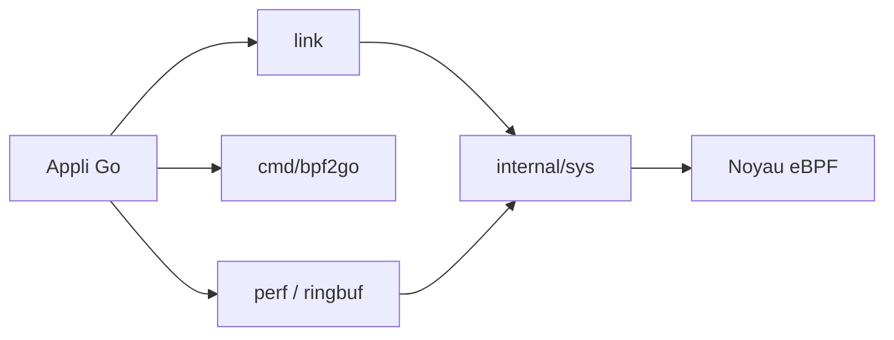

# cilium/ebpf

> Bibliothèque Go pure pour charger, compiler et déboguer des programmes eBPF.

## Le problème
Manipuler eBPF depuis un processus Go sans dépendances C lourdes est délicat.

## Ce que ça fait vraiment
Paquets `asm` (assembleur), `link` (attache aux hooks), `perf` et `ringbuf` (lecture d'événements), `btf`, `features`, `rlimit`, `pin`, et `cmd/bpf2go` qui compile du C et génère le code Go de chargement. Linux (amd64, arm64) et Windows amd64 pris en charge.

## Comment c'est branché


## Essayer
```bash
# Aucune commande dans le README : voir le guide en ligne "Getting Started" (ebpf-go.dev)
```

## Coût et pièges
Gratuit ; suppose un noyau Linux récent (CI sur LTS ≥ 4.4 « devrait fonctionner ») et des droits pour charger du eBPF. Politique IA stricte pour les contributions.

## Ce que ce n'est pas
Pas un outil d'observabilité prêt à l'emploi : c'est une brique pour en construire.

## Alternatives
Aucune alternative nommée dans le README.

## Pour toi
Ignorer sauf besoin d'observabilité noyau en Go : hors du cœur data/IA, même si utile en MLOps très bas niveau.

