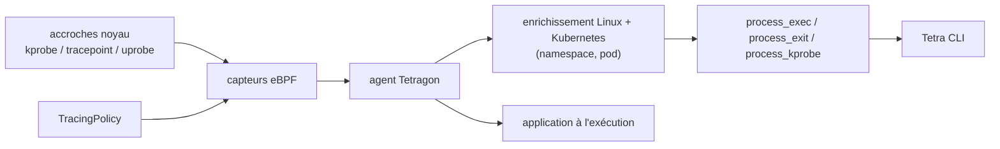

# cilium/tetragon

> Observabilité de sécurité et application de politiques à l'exécution, par eBPF, dans Kubernetes.

## Le problème
Savoir qu'un conteneur a lancé un binaire inattendu, lu un fichier sensible ou ouvert une connexion
sortante suppose des sondes noyau ; les corréler à un pod et un namespace suppose autre chose encore.

## Ce que ça fait vraiment
Observe des points d'accroche critiques du noyau via ses capteurs eBPF et produit des événements
enrichis de métadonnées Linux **et** Kubernetes. Par défaut il émet `process_exec` et `process_exit`,
soit le cycle de vie complet des processus. Pour les cas plus fins, le tracing générique produit
`process_kprobe`, `process_tracepoint` et `process_uprobe`, pilotés par des objets `TracingPolicy` :
observabilité réseau, accès à des noms de fichiers, surveillance des credentials, exécutions
privilégiées. Il ne fait pas que détecter : il peut réagir aux événements significatifs.

## Comment c'est branché

## Essayer
Aucune commande n'est écrite dans le README : il renvoie aux guides de démarrage officiels
(essai sur Kubernetes, essai sur Linux, déploiement, installation du Tetra CLI).

## Coût et pièges
Gratuit, mais eBPF impose un noyau récent et des privilèges élevés sur les nœuds. Le volume
d'événements `process_exec` sur un cluster chargé est le vrai coût : stockage et pipeline à prévoir.

## Ce que ce n'est pas
Pas un SIEM ni un stockage d'événements : Tetragon produit le flux, la collecte et la corrélation
sont ailleurs. Pas utile hors Linux. Le README est une page d'aiguillage : tout le concret est dans
la documentation externe, rien n'est reproductible depuis le dépôt seul.

## Alternatives
Aucune alternative nommée dans le README.

## Pour toi
À connaître si tes modèles tournent dans un cluster à contraintes ; sinon c'est un sujet SRE.
