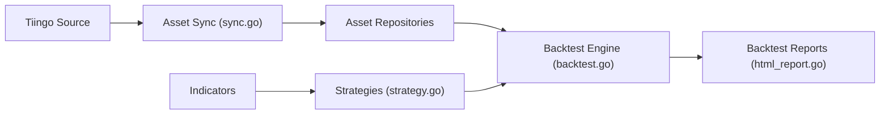

# cinar/indicator

> Bibliothèque Go d'indicateurs d'analyse technique et de backtesting, pour la recherche et l'enseignement.

## Le problème
Calculer des indicateurs (RSI, MACD, Bollinger…) et tester des stratégies sur historique sans repartir de zéro.

## Ce que ça fait vraiment
- Plus de 80 indicateurs (tendance, momentum, volatilité, volume) et valorisation (VA, VAN).
- Version 2 : flux Go (canaux) en entrée et en sortie, génériques, couverture de tests d'au moins 90 %.
- Stratégies d'exemple, backtest avec rapport HTML, ratios de Sharpe et de Sortino.
- Dépôts d'actifs : système de fichiers, mémoire, Tiingo.

## Comment c'est branché


## Essayer
```bash
go get github.com/cinar/indicator/v2
docker run -it --rm -v $(pwd)/output:/app/output ghcr.io/cinar/indicator:latest --api-key YOUR_TIINGO_API_KEY --days 365 --assets aapl msft googl --strategies apo,macd,rsi
```

## Coût et pièges
Clé Tiingo gratuite pour les données. Licence AGPLv3 pour la v2 avec licence commerciale en parallèle ; la v1 est sous MIT.

## Ce que ce n'est pas
Pas un conseil d'investissement : le README insiste sur les limites des résultats de backtest.

## Alternatives
Le README cite Indicator TS, version TypeScript.

## Pour toi
À surveiller : correct pour prototyper des signaux en Go ; en Python, tu iras plus vite avec l'écosystème pandas, et l'AGPL pèse sur un usage commercial.

