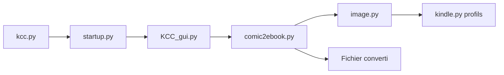

# ciromattia/kcc

> Convertisseur de mangas et BD en fichiers plein écran pour liseuses Kindle, Kobo et reMarkable.

## Le problème
La plupart des conversions pour liseuses ajoutent des marges, produisent des fichiers volumineux et des noirs délavés.

## Ce que ça fait vraiment
Prend dossiers d'images, CBZ, CBR, CB7, EPUB ou PDF et sort MOBI/AZW3, EPUB/KEPUB, CBZ, PDF ou images, calibrés par profil d'appareil. Réduit à la résolution de l'écran (un volume de 600 Mo tombe à 100 Mo), corrige les niveaux de noir, supprime l'effet arc-en-ciel des écrans couleur, détecte les doubles pages. Interface graphique et outils CLI `c2e` et `c2p`.

## Comment c'est branché


## Essayer
```bash
python -m venv venv
source venv/bin/activate
pip install -r requirements.txt
python kcc.py
```

## Coût et pièges
Gratuit. KindleGen (via Kindle Previewer) pour le MOBI, 7-Zip facultatif pour accélérer. Le MOBI de Kindle Scribe 2025 peut afficher des pages blanches : utiliser le PDF. Au démarrage, l'application fait une vérification de version en ligne.

## Ce que ce n'est pas
Pas un outil Calibre, et le README déconseille Calibre pour modifier la sortie. Ce n'est pas Kindle Comic Creator d'Amazon.

## Alternatives
Calibre : déconseillé pour ce format ; Kindle Comic Creator d'Amazon : outil d'éditeurs, non équivalent.

## Pour toi
Ignorer : utilitaire de lecture de manga sans lien avec data/IA/MLOps.

