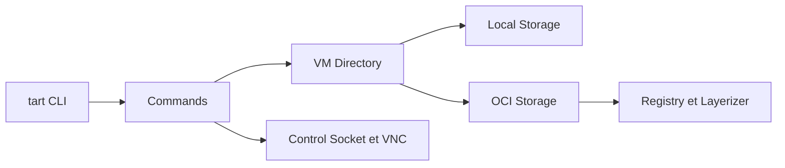

# cirruslabs/tart

> Outil en ligne de commande pour créer et lancer des VM macOS et Linux sur Apple Silicon.

## Le problème
Faire tourner des builds et tests macOS reproductibles en CI demande des machines virtuelles jetables et versionnées.

## Ce que ça fait vraiment
CLI Swift au-dessus de Virtualization.Framework : create, clone, run, exec, push/pull d'images de VM vers tout registre compatible OCI, cache d'IPSW et de couches, accès VNC et canal de contrôle pour exécuter des commandes dans l'invité. Plugin Packer pour automatiser la création.

## Comment c'est branché


## Essayer
```bash
brew install openai/tools/tart
tart clone ghcr.io/cirruslabs/macos-tahoe-base:latest tahoe-base
tart run tahoe-base
```

## Coût et pièges
Apple Silicon et macOS 13 minimum ; l'image de base pèse 25 Go. Licence présente mais non identifiée par GitHub : à lire avant usage en entreprise.

## Ce que ce n'est pas
Pas un outil multiplateforme : le runtime est centré sur macOS Apple Silicon, même si le code compile aussi sous Linux.

## Alternatives
Tart Packer Plugin pour l'automatisation ; aucune autre alternative nommée.

## Pour toi
À surveiller : pertinent seulement si ta CI ou tes builds tournent sur Mac Apple Silicon ; sinon hors périmètre, et la licence est à vérifier.

