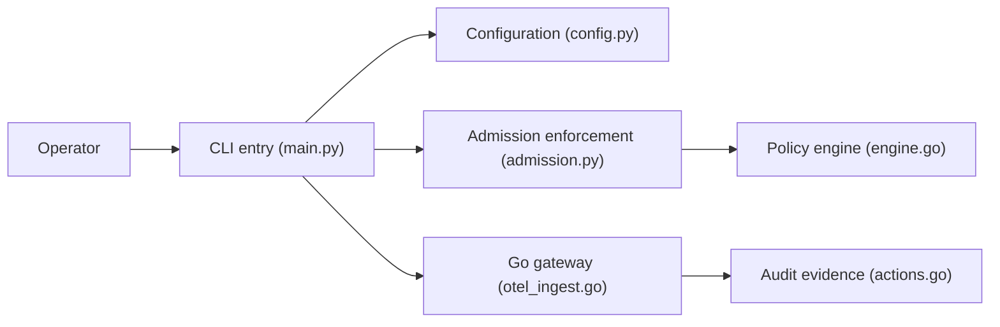

# cisco-ai-defense/defenseclaw

> Couche de gouvernance sécurité pour OpenClaw et runtimes d'agents : scan, inspection du trafic, audit.

## Le problème
Avant d'autoriser une capacité d'agent ou d'observer son trafic, il faut des contrôles d'admission, des politiques et une trace d'audit durable.

## Ce que ça fait vraiment
CLI Python d'opérateur plus passerelle Go, hooks de connecteurs, politiques, scanners et exporteurs d'observabilité. Il scanne les capacités avant usage, inspecte le trafic d'exécution, applique des politiques d'admission et exporte des preuves d'audit. Le README précise qu'il ne prouve pas qu'un agent est sans risque. Les détails d'installation sont sur le site de documentation, pas dans le README.

## Comment c'est branché


## Essayer
```bash
git clone https://github.com/cisco-ai-defense/defenseclaw.git
cd defenseclaw
make build
make test
```
Ces cibles sont réservées aux contributeurs ; l'installation passe par le site de documentation.

## Coût et pièges
Gratuit. Toolchain : Python >=3.10 <3.14, Go 1.26.4 ; le dépôt sert de contrat de développement, l'installation d'un hôte gérée se fait par les scripts de mise à jour officiels. Les liens internes n'ont pas tous été vérifiés.

## Ce que ce n'est pas
Pas une garantie de sécurité : c'est une couche d'application et de preuve. Il gouverne OpenClaw et runtimes compatibles, pas n'importe quel agent.

## Alternatives
Aucune alternative nommée dans le README.

## Pour toi
À surveiller : pertinent si tu déploies des agents en entreprise et as besoin de traces d'audit ; sans OpenClaw, l'intérêt pratique est limité.

