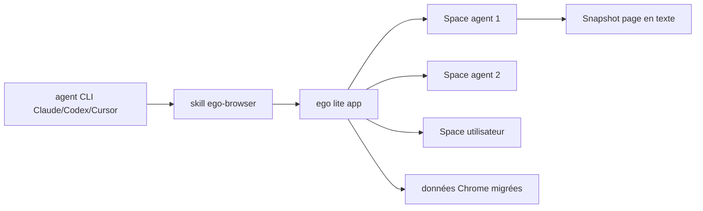

# citrolabs/ego-lite

> Navigateur macOS où l'agent travaille dans son espace pendant que vous gardez le vôtre.

## Le problème
Les outils d'automatisation navigateur pilotent un navigateur tiers : les sessions
connectées ne suivent pas, la connexion est instable, et l'agent vous prend la main.

## Ce que ça fait vraiment
Un seul navigateur, partagé entre vous et vos agents via des « Spaces » — espaces de
travail isolés à l'intérieur de la même application. Chaque agent a le sien, plusieurs
tournent en parallèle sans se voler les onglets, et on voit lequel est actif pour le
reprendre ou l'arrêter. La couche `ego-browser` expose le navigateur comme des
fonctions JavaScript en page (snapshot, fill, click, wait, navigate, capture) : l'agent
écrit un extrait qui enchaîne plusieurs étapes en une passe, au lieu d'une boucle
d'appels CLI. Migration optionnelle des données Chrome au premier lancement
(sessions, cookies, extensions, favoris).

## Comment c'est branché


## Essayer
```bash
npx skills add citrolabs/ego-lite
```

## Coût et pièges
macOS uniquement aujourd'hui, Windows en bêta fermée, Linux au programme. Gratuit.
Collecte revendiquée comme étroite : des signaux produit simples, par exemple si
ego lite est défini comme navigateur par défaut. Migrer ses données Chrome donne à
l'agent l'accès à toutes vos sessions connectées — c'est l'argument de vente et le
risque principal.

## Ce que ce n'est pas
Pas une bibliothèque d'automatisation : c'est un navigateur complet à installer.
Aucune licence déclarée dans le README. Le tableau comparatif et les benchmarks
(jusqu'à 2,5× plus rapide) sont produits par l'éditeur, sur quatre tâches choisies
par lui. L'accumulation d'expérience annoncée est marquée « coming soon ».

## Alternatives
- Browser-Use : bibliothèque pilotant un navigateur tiers, sans navigateur propre.
- agent-browser (Vercel) : même famille, avec entrée sémantique compressée.
- ChatGPT Atlas / Perplexity Comet : navigateurs IA, mais seul leur agent intégré pilote.

## Pour toi
À surveiller pour du scraping authentifié piloté par agent ; l'exposition de tes
sessions Chrome mérite une réflexion avant de dire oui à la migration.
