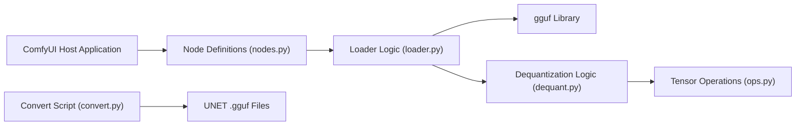

# city96/ComfyUI-GGUF

> Nœuds ComfyUI pour charger des modèles de diffusion et encodeurs T5 quantifiés au format GGUF.

## Le problème
Les modèles à transformeur comme Flux sont volumineux : sur un GPU modeste, ils ne tiennent pas en mémoire au format d'origine.

## Ce que ça fait vraiment
Le dépôt remplace le chargeur « Load Diffusion Model » de ComfyUI par « Unet Loader (GGUF) », et ajoute des chargeurs `*CLIPLoader (gguf)` pour T5. Les fichiers `.gguf` (quantification à débit variable, popularisée par llama.cpp) se placent dans `ComfyUI/models/unet`. Le chargement des LoRA est expérimental. Un dossier `tools/` fournit des scripts pour créer ses propres quantifications. Le README liste des modèles déjà quantifiés : flux1-dev, flux1-schnell, stable-diffusion-3.5-large et -turbo, t5_v1.1-xxl.

## Comment c'est branché


## Essayer
```bash
git clone https://github.com/city96/ComfyUI-GGUF
pip install --upgrade gguf
```
Sous Windows portable, les commandes utilisent `python_embeded\python.exe -s -m pip install -r requirements.txt`.

## Coût et pièges
Gratuit. Le README avertit que le projet est « très en cours de développement » et qu'il faut une version récente de ComfyUI. Sur macOS Sequoia, torch 2.4.1 est requis (2.6 nightly cause une erreur). Le nœud « Force/Set CLIP Device » n'en fait pas partie.

## Ce que ce n'est pas
Ce n'est pas un outil autonome ni un convertisseur clé en main : il faut ComfyUI et des fichiers GGUF. Le gain de mémoire se paie en qualité selon le niveau de quantification, non mesuré dans le README. Le mainteneur est unique, 242 issues ouvertes.

## Alternatives
Aucune alternative nommée dans le README.

## Pour toi
À surveiller : utile si tu fais tourner Flux ou SD3.5 sur peu de VRAM avec ComfyUI ; sinon sans objet, et le statut « WIP » avec un seul mainteneur invite à ne pas en dépendre.
