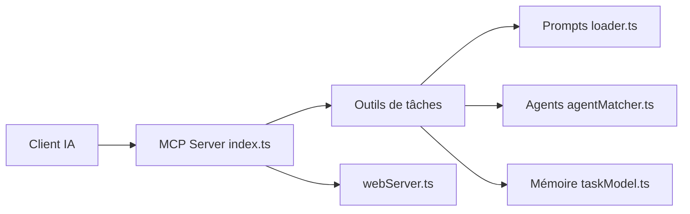

# cjo4m06/mcp-shrimp-task-manager

> Serveur MCP qui aide un agent à planifier, découper et suivre des tâches de développement avec mémoire persistante.

## Le problème
Un agent de codage perd le contexte entre sessions et enchaîne mal les tâches complexes.

## Ce que ça fait vraiment
Serveur MCP (TypeScript) exposant des outils : planification, décomposition en sous-tâches avec dépendances, exécution, mode recherche, règles de projet, réflexion sur une tâche. Les tâches sont sauvegardées dans `DATA_DIR`. Des agents spécialisés peuvent être associés, les prompts sont personnalisables et traduits. Interfaces : GUI web légère et « Task Viewer » React séparé.

## Comment c'est branché


## Essayer
```bash
git clone https://github.com/cjo4m06/mcp-shrimp-task-manager.git
cd mcp-shrimp-task-manager
npm install
npm run build
claude --dangerously-skip-permissions --mcp-config .mcp.json
```

## Coût et pièges
Node 18+, client MCP. L'exemple du README lance Claude Code avec `--dangerously-skip-permissions`, ce qui retire les confirmations : à éviter hors environnement isolé. Dernier push en août 2025 ; 46 issues ouvertes.

## Ce que ce n'est pas
Pas un gestionnaire de projet d'équipe : c'est une mémoire de tâches pour un agent. Certaines implémentations d'outils n'ont pas été examinées.

## Alternatives
Aucune alternative nommée dans le README.

## Pour toi
À surveiller : l'idée de mémoire de tâches persistante pour agents est utile, mais le dépôt est stagnant depuis plus d'un mois et l'option sans permissions est risquée.

