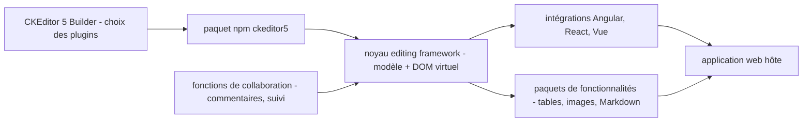

# ckeditor/ckeditor5

> **Embeddable JavaScript rich-text editor, for web teams that must ship structured WYSIWYG input.**

## The problem

Without it you write your own rich editing surface on top of `contenteditable`: selection,
pasting, tables, lists, undo, accessibility and localisation all by hand. The README also
frames a collaboration need — comments and change tracking — that a plain `<textarea>` does
not begin to cover.

## What it actually does

It is an editor written in TypeScript, with an MVC architecture, a data model of its own and
a virtual DOM. The README is clear that it is not only a widget: it is also a framework for
building a custom editor from a core plus feature packages. Announced features include tables,
lists, font styles, accessibility helpers, multi-language support, Markdown input and output,
source editing, export to PDF and Word, and images and videos with several upload and storage
systems. For collaboration the README names comments and change tracking. Official
integrations exist for Angular, React and Vue, and since v37.0.0 the official packages ship
native type definitions.

## How it is wired



The README describes a monorepo: the `ckeditor5` repository centralises several packages that
make up the editing framework, on top of which the feature packages are built, plus the
development tooling — the builder and the test runner. The recommended entry point is the
CKEditor 5 Builder, which produces a ready-to-use package with the plugins you picked;
integration then goes through the npm package or one of the framework integrations. Real file
names are unknown: no code-derived diagram accompanies this repository.

## Trying it

```
# No installation command is written in the README.
# It points to the online "Quick Start" guide, to the CKEditor 5 Builder
# (builder.ckeditor.com) for a ready-made package, and to the Angular / React / Vue guides.
```

The README also mentions a "Build with AI" path: install the official CKEditor skill so a
coding agent handles installation, configuration and licensing. No command is given for that
either.

## Cost and traps

The model is dual-licensed: GPL 2 or later, or commercial terms from CKSource. GPL is viral
for a proprietary product — that is the main trap, and also why GitHub reports the licence as
NOASSERTION. The README explicitly mentions "premium features" and offers a free 14-day trial
after creating an account, so part of what is listed (collaboration, exports) may sit outside
the free scope, and the README does not say where the line falls. A JavaScript build chain is
required on the host project.

## What it is not

Not a CMS and not an application: nothing stores the content, you bring your own backend, and
for images your own upload and storage system. Not a fully free-to-use brick either — the
"market leader" wording in the README is sales vocabulary, and a paid offering sits behind the
announced features. Finally, not a Markdown editor: Markdown is one input/output format among
others, the internal model belongs to the project.

## Alternatives

- `basecamp/trix`: a much smaller rich-text editor under a permissive licence, preferable when
  you only need a simple input area without a plugin framework.
- `givanz/VvvebJs`: a page builder, not an editing field — relevant only if the need is to
  compose a whole page rather than edit a block of text.

## For you

Little overlap with day-to-day data / AI / MLOps work: this is a web front-end brick. It
becomes relevant when you build a product interface — annotation, document review, assisted
writing — and there the licensing question has to be settled early, before the integration is
written.
