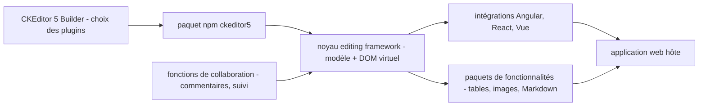

# ckeditor/ckeditor5

> **Éditeur de texte riche embarquable en JavaScript, pour équipes web devant intégrer une saisie WYSIWYG structurée.**

## Le problème

Sans lui, il faut écrire soi-même une zone d'édition riche : gérer la sélection, le collage,
les tables, les listes, l'annulation, l'accessibilité et le multilingue à partir de
`contenteditable`. Le README pose aussi le besoin de collaboration (commentaires, suivi des
modifications) qu'un `<textarea>` ne couvre pas du tout.

## Ce que ça fait vraiment

C'est un éditeur écrit en TypeScript, avec une architecture MVC, un modèle de données propre
au projet et un DOM virtuel. Le README insiste sur le fait qu'il ne se limite pas à un widget :
c'est aussi un framework pour construire son propre éditeur, à partir d'un noyau et de paquets
de fonctionnalités. Les fonctions annoncées : tables, listes, styles de police, aides à
l'accessibilité, support multilingue, entrée/sortie Markdown, édition de la source, export PDF
et Word, gestion d'images et de vidéos avec plusieurs systèmes d'envoi et de stockage. Côté
collaboration, le README cite les commentaires et le suivi des modifications. Des intégrations
officielles existent pour Angular, React et Vue. Depuis la v37.0.0, les paquets officiels
embarquent leurs définitions de types.

## Comment c'est branché



Le README décrit un monorepo : le dépôt `ckeditor5` centralise plusieurs paquets qui forment
le framework d'édition, sur lequel s'appuient les paquets de fonctionnalités, plus les outils
de développement — le builder et le lanceur de tests. Le point d'entrée recommandé pour un
utilisateur est le CKEditor 5 Builder, qui produit un paquet prêt à l'emploi avec les plugins
choisis ; l'intégration dans l'application passe ensuite par le paquet npm ou par une des
intégrations de framework. Les noms de fichiers réels ne sont pas connus : aucun diagramme
tiré du code n'accompagne ce dépôt.

## Essayer

```
# Aucune commande d'installation n'est écrite dans le README.
# Il renvoie au guide « Quick Start » de la documentation en ligne,
# au CKEditor 5 Builder (builder.ckeditor.com) pour télécharger un paquet prêt,
# et aux guides d'intégration Angular / React / Vue.
```

Le README mentionne aussi une voie « Build with AI » : installer le skill officiel CKEditor
pour qu'un agent de code gère installation, configuration et licence. Aucune commande n'est
donnée pour cela non plus.

## Coût et pièges

Le modèle est à double licence : GPL 2 ou ultérieure, ou bien des conditions commerciales de
CKSource. La GPL est contaminante pour un produit propriétaire — c'est le piège principal, et
c'est aussi pourquoi la licence remonte en `NOASSERTION` côté GitHub. Le README parle
explicitement de « fonctionnalités premium » et propose un essai gratuit de 14 jours après
création d'un compte : une partie de ce qui est listé (collaboration, exports) n'est donc pas
forcément dans le périmètre gratuit, et le README ne dit pas où passe la frontière. Il faut
une chaîne de build JavaScript côté projet.

## Ce que ce n'est pas

Ce n'est pas un CMS ni une application : rien ne stocke le contenu, il faut brancher son
propre backend, et pour les images son propre système d'envoi et de stockage. Ce n'est pas
non plus une brique entièrement libre d'usage : la mention « market leader » du README est du
vocabulaire commercial, et derrière les fonctions annoncées se trouve une offre payante. Ce
n'est enfin pas un éditeur Markdown : le Markdown y est une entrée/sortie parmi d'autres, le
modèle interne est propre au projet.

## Alternatives

- `basecamp/trix` : éditeur riche beaucoup plus petit et sous licence permissive, à préférer
  si on veut une zone de saisie simple sans framework de plugins.
- `givanz/VvvebJs` : constructeur de pages, pas un champ d'édition — à retenir seulement si
  le besoin est de composer une page entière plutôt que d'éditer un bloc de texte.

## Pour toi

Peu de recoupement avec un usage data / IA / MLOps direct : c'est une brique de front web.
Cela devient pertinent si tu construis l'interface d'un produit — annotation, revue de
documents, rédaction assistée — et là il faut trancher tôt la question de la licence, avant
d'avoir écrit l'intégration.
