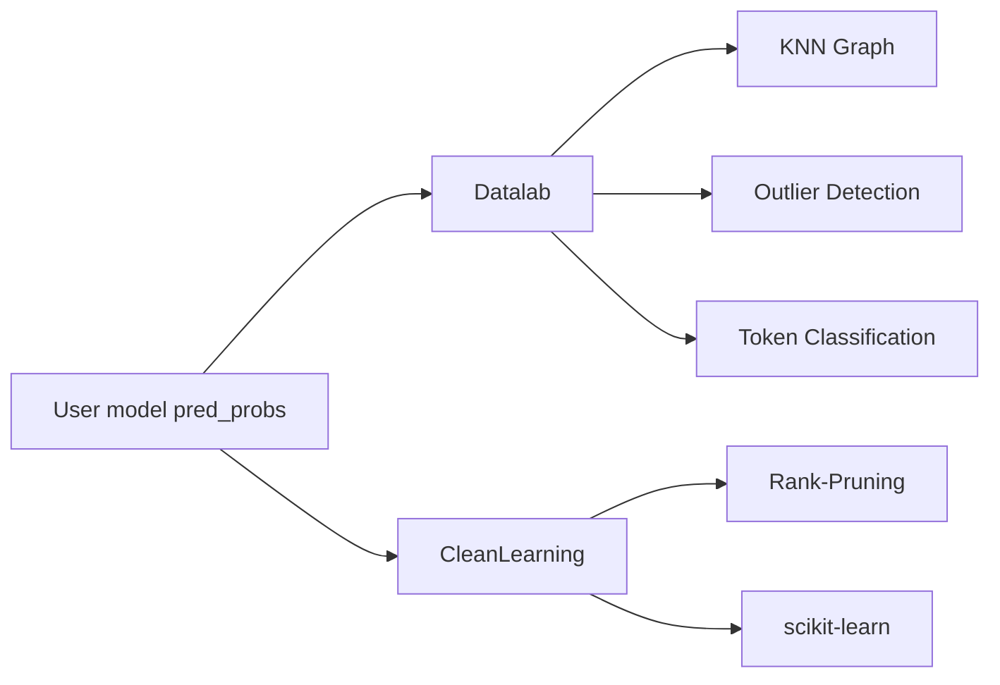

# cleanlab/cleanlab

> Bibliothèque Python qui détecte erreurs d'étiquettes, doublons et outliers dans un jeu de données ML.

## Le problème
Des étiquettes fausses et des données aberrantes dégradent les modèles, et les repérer à la main sur des milliers d'exemples est impossible.

## Ce que ça fait vraiment
`Datalab.find_issues()` utilise embeddings et `pred_probs` de ton propre modèle pour lister erreurs d'étiquettes, outliers, doublons, puis `report()`.
`CleanLearning` enveloppe n'importe quel classifieur scikit-learn-compatible pour entraîner une version robuste au bruit.
Confident learning publié ; tâches dédiées : multi-label, token classification, régression, segmentation, détection d'objets, multi-annotateurs, active learning.
Agnostique au modèle et au type de données (texte, image, audio, tabulaire).

## Comment c'est branché

## Essayer
Aucune commande shell dans le README : installation via uv, pip ou conda renvoyée à la doc ; exemple Python `cleanlab.Datalab(...)` fourni.

## Coût et pièges
Gratuit, Apache-2.0, Python 3.10+ ; la qualité du diagnostic dépend de probabilités prédites hors échantillon (validation croisée).

## Ce que ce n'est pas
Pas un outil d'annotation : il signale, tu corriges.
Pas la plateforme commerciale Cleanlab Studio.

## Alternatives
Aucune alternative nommée dans le README.

## Pour toi
À adopter : un audit Datalab avant tout entraînement coûte quelques lignes et trouve souvent des gains sans toucher au modèle.
