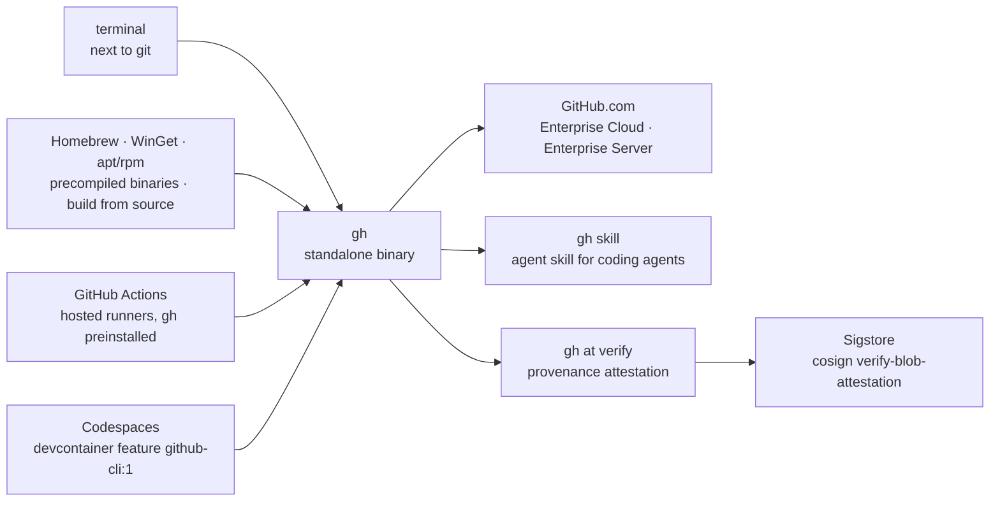

# cli/cli

> **GitHub's official command-line client: pull requests, issues and releases from the terminal.**

## The problem

Working with `git` in a terminal and handling GitHub objects — pull requests, issues, reviews,
releases, artifacts — are two separate worlds: the second one forces you into a browser, or
into writing your own REST API calls with a token and `curl`. Automation around GitHub ends up
as a pile of hand-rolled HTTP requests, with no shared authentication and no stable output
format.

## What it actually does

`gh` is a standalone binary that, per the README, "brings pull requests, issues, and other
GitHub concepts to the terminal next to where you are already working with `git` and your
code". The featured screenshot shows `gh pr status`. The README does not enumerate the command
catalogue and points to the online manual for usage.

Two capabilities are documented explicitly in the README. First `gh skill`, which installs and
updates an *agent skill* for driving `gh` from coding agents (`gh skill install cli/cli gh
--scope user`, then `gh skill update gh`). Second `gh at verify`, which checks the provenance
attestation of a downloaded binary: since version 2.50.0 releases produce a signed *Build
Provenance Attestation*, backed by Sigstore, tying the artifact to the origin repository, the
git revision and the build workflow (`.github/workflows/deployment.yml`). Since 2.93.0,
releases are published as *immutable releases*.

The declared scope covers GitHub.com, GitHub Enterprise Cloud and supported GitHub Enterprise
Server versions, on macOS, Windows and Linux.

## How it is wired

No code-derived diagram exists for this repository: this graph is reconstructed from the README
alone, so it names distribution channels and commands rather than source files.



## Trying it

The README gives no literal install command: it links out to `docs/install_macos.md`,
`docs/install_linux.md`, `docs/install_windows.md`, `docs/install_source.md` and the releases
page. The only commands actually present are the skill and verification ones:

```shell
# Install the skill (user scope recommended)
gh skill install cli/cli gh --scope user

# Update the skill after a `gh` release
gh skill update gh
```

```shell
$ gh at verify -R cli/cli gh_2.62.0_macOS_arm64.zip
```

```shell
$ cosign verify-blob-attestation --bundle cli-cli-attestation-3120304.sigstore.json \
      --new-bundle-format \
      --certificate-oidc-issuer="https://token.actions.githubusercontent.com" \
      --certificate-identity="https://github.com/cli/cli/.github/workflows/deployment.yml@refs/heads/trunk" \
      gh_2.62.0_macOS_arm64.zip
```

Inside a Codespace, the README gives the devcontainer entry:

```json
"features": {
  "ghcr.io/devcontainers/features/github-cli:1": {}
}
```

## Cost and traps

- **Nothing to pay for the tool itself**, but everything goes through a GitHub account and its
  authentication: the tool is only useful wired to GitHub.com, Enterprise Cloud or a supported
  Enterprise Server. Hence the "depends on a SaaS" flag.
- **PGP key rotation on 5 September 2026**: the README opens with an *IMPORTANT* callout
  warning that rotating the signing key for the Linux package repositories can break install or
  update, pointing to issue 13118. Worth checking before rewiring an apt/rpm install chain.
- **Supply-chain version floors**: provenance attestation only exists from 2.50.0, immutable
  releases only from 2.93.0. An older version cannot be verified this way.
- **On GitHub Actions runners**, `gh` is preinstalled and refreshed weekly, so the version is
  not pinned. The README states that a specific version means installing it yourself via the
  per-OS instructions.
- **Community packages**: beyond Homebrew, WinGet and the Debian/RPM repositories, the README
  labels the remaining installers *community-supported*, outside the project's guarantee.

## What it is not

- **Not a replacement for `git`.** `gh` is a standalone tool covering GitHub objects; the README
  explicitly contrasts that choice with `hub`, which acted as a proxy to `git`. You keep running
  `git commit` and `git push`.
- **Not a Go library to import**, despite the repository language: the surface documented in the
  README is that of an executable.
- **Not a generic forge client**: nothing in the README mentions GitLab, Gitea or any other
  forge. The announced scope stops at GitHub.com, Enterprise Cloud and Enterprise Server.
- **Not documented here**: the README is deliberately an installation page. The command
  catalogue, its flags and output formats live in the online manual, not in the repository read.

## Alternatives

| | When to prefer it |
|---|---|
| **github/hub** | Named in the README as the unofficial GitHub CLI that preceded `gh`. It acts as a proxy to `git`, so prefer it if you want to enrich existing `git` commands rather than add a separate executable — bearing in mind `gh` is the one GitHub maintains. |
| **jesseduffield/lazygit** | Catalogue neighbour, a terminal UI for `git` itself: prefer it to navigate history, branches and the index visually. Complementary rather than competing — it does not touch pull requests or issues. |

The other catalogue neighbours (`gitleaks/gitleaks`, secret scanning; `plandex-ai/plandex`, a
coding agent; `asdf-vm/asdf`, a tool version manager) are not comparable: none of them drives
GitHub objects from the terminal.

## For you

Useful by default as soon as you automate around GitHub: it is the authenticated, stable path to
open a PR, read an issue or fetch an artifact from a script, without a hand-rolled token or REST
call. Two points are worth the detour for an MLOps profile: `gh at verify` gives binary
provenance verification usable in a delivery pipeline, and `gh skill` exposes the tool to a
coding agent. Skip it if you do not work on GitHub.
