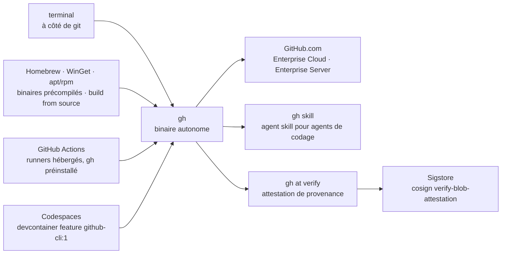

# cli/cli

> **Le client en ligne de commande officiel de GitHub : pull requests, issues et releases depuis le terminal.**

## Le problème

Travailler avec `git` en terminal et gérer les objets GitHub — pull requests, issues, revues,
releases, artefacts — sont deux mondes séparés : le second oblige à quitter le terminal pour
le navigateur, ou à écrire soi-même des appels à l'API REST avec un jeton et `curl`. Les
scripts d'automatisation autour de GitHub finissent en collections de requêtes HTTP maison,
sans authentification partagée ni format de sortie stable.

## Ce que ça fait vraiment

`gh` est un binaire autonome qui, d'après le README, « apporte les pull requests, les issues
et les autres concepts GitHub dans le terminal, à côté de là où l'on travaille déjà avec
`git` ». La capture d'écran mise en avant montre `gh pr status`. Le README ne détaille pas le
catalogue de commandes et renvoie au manuel en ligne pour l'usage.

Deux fonctions sont documentées explicitement dans le README. D'abord `gh skill`, qui installe
et met à jour un *agent skill* permettant de piloter `gh` depuis un agent de codage
(`gh skill install cli/cli gh --scope user`, puis `gh skill update gh`). Ensuite `gh at
verify`, qui vérifie l'attestation de provenance d'un binaire téléchargé : depuis la version
2.50.0, les releases produisent une *Build Provenance Attestation* signée, adossée à Sigstore,
qui relie l'artefact au dépôt d'origine, à la révision git et au workflow de construction
(`.github/workflows/deployment.yml`). Depuis la 2.93.0, les releases sont publiées comme
*immutable releases*.

Le périmètre déclaré couvre GitHub.com, GitHub Enterprise Cloud et les versions supportées de
GitHub Enterprise Server, sur macOS, Windows et Linux.

## Comment c'est branché

Aucun diagramme tiré du code n'existe pour ce dépôt : ce schéma est reconstruit depuis le seul
README, il nomme donc des canaux de distribution et des commandes, pas des fichiers source.



## Essayer

Le README ne donne aucune commande d'installation en clair : il renvoie par liens vers
`docs/install_macos.md`, `docs/install_linux.md`, `docs/install_windows.md`,
`docs/install_source.md` et la page des releases. Les seules commandes littéralement
présentes sont celles du skill et de la vérification :

```shell
# Install the skill (user scope recommended)
gh skill install cli/cli gh --scope user

# Update the skill after a `gh` release
gh skill update gh
```

```shell
$ gh at verify -R cli/cli gh_2.62.0_macOS_arm64.zip
```

```shell
$ cosign verify-blob-attestation --bundle cli-cli-attestation-3120304.sigstore.json \
      --new-bundle-format \
      --certificate-oidc-issuer="https://token.actions.githubusercontent.com" \
      --certificate-identity="https://github.com/cli/cli/.github/workflows/deployment.yml@refs/heads/trunk" \
      gh_2.62.0_macOS_arm64.zip
```

Dans un Codespace, le README donne l'entrée de devcontainer :

```json
"features": {
  "ghcr.io/devcontainers/features/github-cli:1": {}
}
```

## Coût et pièges

- **Rien à payer côté outil**, mais tout passe par un compte GitHub et son authentification :
  l'outil n'a d'intérêt que branché sur GitHub.com, Enterprise Cloud ou un Enterprise Server
  supporté. C'est la raison de l'alerte « dépend d'un SaaS ».
- **Rotation de clé PGP au 5 septembre 2026** : le README ouvre sur un encadré *IMPORTANT*
  signalant que la rotation de la clé de signature des dépôts de paquets Linux peut casser
  l'installation ou la mise à jour, avec renvoi à l'issue 13118. À vérifier avant de recâbler
  une chaîne d'installation apt/rpm.
- **Versions planchers pour la supply chain** : l'attestation de provenance n'existe qu'à
  partir de 2.50.0, les *immutable releases* qu'à partir de 2.93.0. Une version plus ancienne
  ne se vérifie pas de cette façon.
- **Sur les runners GitHub Actions**, `gh` est préinstallé et mis à jour chaque semaine : la
  version n'est donc pas figée. Le README précise qu'une version précise impose de
  l'installer soi-même via les instructions par système.
- **Paquets communautaires** : au-delà de Homebrew, WinGet et des dépôts Debian/RPM, le README
  classe les autres installateurs en *community-supported*, hors garantie du projet.

## Ce que ce n'est pas

- **Ce n'est pas un remplaçant de `git`.** `gh` est un outil autonome qui couvre les objets
  GitHub ; le README oppose explicitement ce choix à celui de `hub`, qui se comportait en
  proxy de `git`. On continue de faire `git commit` et `git push`.
- **Ce n'est pas une bibliothèque Go à importer** malgré le langage du dépôt : la surface
  documentée dans le README est celle d'un exécutable.
- **Ce n'est pas un client GitHub générique hors GitHub** : rien dans le README ne mentionne
  GitLab, Gitea ou un autre forge. Le périmètre annoncé s'arrête à GitHub.com, Enterprise
  Cloud et Enterprise Server.
- **Ce n'est pas documenté ici** : le README est volontairement une page d'installation. Le
  catalogue des commandes, leurs options et leurs formats de sortie vivent dans le manuel en
  ligne, pas dans le dépôt lu.

## Alternatives

| | Quand le préférer |
|---|---|
| **github/hub** | Nommé dans le README comme l'outil non officiel qui a précédé `gh`. Il agit en proxy de `git`, donc à préférer si l'on veut enrichir les commandes `git` existantes plutôt qu'ajouter un exécutable distinct — sachant que `gh` est celui que GitHub maintient. |
| **jesseduffield/lazygit** | Voisin du catalogue, interface terminal pour `git` lui-même : à préférer pour naviguer visuellement dans l'historique, les branches et l'index. Complémentaire plutôt que concurrent — il ne touche pas aux pull requests ni aux issues. |

Les autres voisins du catalogue (`gitleaks/gitleaks`, détection de secrets ;
`plandex-ai/plandex`, agent de codage ; `asdf-vm/asdf`, gestionnaire de versions d'outils) ne
sont pas comparables : aucun ne pilote les objets GitHub depuis le terminal.

## Pour toi

Utile par défaut dès qu'on automatise autour de GitHub : c'est le chemin authentifié et stable
pour ouvrir une PR, lire une issue ou récupérer un artefact depuis un script, sans jeton
bricolé ni appel REST maison. Deux points valent le détour pour un profil MLOps : `gh at
verify` donne une vérification de provenance des binaires utilisable en chaîne de livraison,
et `gh skill` expose l'outil à un agent de codage. À ignorer si l'on ne travaille pas sur
GitHub.
