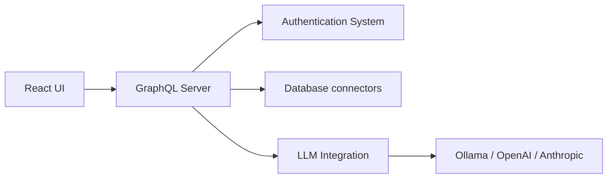

# clidey/whodb

> Espace de travail léger et auto-hébergé pour explorer, éditer et interroger des bases de données.

## Le problème
Inspecter une base inconnue oblige à installer un client lourd ou à écrire du SQL à l'aveugle.

## Ce que ça fait vraiment
Interface web avec grille éditable, graphe de schéma, éditeur de requêtes multi-cellules, import/export et génération de données factices. Chat en langage naturel optionnel avec Ollama, LM Studio, OpenAI, Anthropic ou Gemini. Version bureau, CLI avec interface terminal et serveur MCP. Connecteurs PostgreSQL, MySQL, SQLite, MongoDB, Redis, ElasticSearch, ClickHouse.

## Comment c'est branché


## Essayer
```bash
docker run --rm -it -p 8080:8080 clidey/whodb
```
Puis ouvrir http://localhost:8080.

## Coût et pièges
Gratuit ; l'IA est optionnelle et une clé d'API n'est nécessaire que pour un fournisseur hébergé. Générer et conserver `WHODB_ENCRYPTION_KEY` pour garder les sessions.

## Ce que ce n'est pas
Pas un outil de BI ni d'orchestration. Le chat n'est pas garanti fiable : vérifier le SQL généré.

## Alternatives
Le README ne nomme aucune alternative.

## Pour toi
À adopter pour explorer vite des bases de développement : un `docker run` suffit, licence Apache-2.0, actif.
