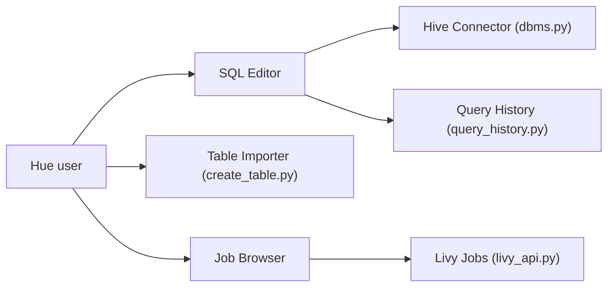

# cloudera/hue

> Assistant SQL web pour interroger bases et entrepôts de données, utilisé en entreprise.

## Le problème
Donner à des analystes un éditeur SQL partagé, avec navigateur de tables et de fichiers, au-dessus de Hive, Impala et autres moteurs.

## Ce que ça fait vraiment
Éditeur SQL interactif (coloration, autocomplétion), navigateur de fichiers (HDFS, S3, ABFS, Ozone, GS), navigateur de jobs (Hive, Impala, YARN, Livy Spark), navigateur et importeur de tables (CSV/Excel), connecteurs multiples (Hive, Impala, MySQL, PostgreSQL…), API REST/Python/CLI. Le dépôt date de 2010.

## Comment c'est branché


## Essayer
```bash
docker run -it -p 8888:8888 gethue/hue:latest
helm repo add gethue https://helm.gethue.com
helm repo update
helm install hue gethue/hue
```

## Coût et pièges
Gratuit. Il faut configurer les bases à interroger après le démarrage. Les mentions de « 1000+ clients » viennent du README, non vérifiées.

## Ce que ce n'est pas
Pas un outil de BI ni de notebook. Orienté écosystème Hadoop/entrepôts ; le README ne mentionne aucune fonction d'IA.

## Alternatives
Aucune alternative nommée dans le README.

## Pour toi
À surveiller : pertinent si ton stack est Hive/Impala/Trino et que tu veux un éditeur SQL partagé ; sinon un notebook ou un client SQL plus léger suffit.

