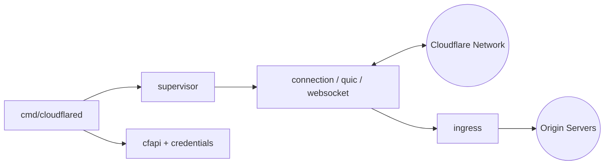

# cloudflare/cloudflared

> Démon en ligne de commande qui relie un service interne au réseau Cloudflare, pour équipes infra et devops.

## Le problème
Exposer un service interne sur Internet oblige à ouvrir des ports sur le pare-feu. Ici, l'origine peut rester fermée : c'est le démon qui ouvre la connexion sortante.

## Ce que ça fait vraiment
- Le démon se place entre le réseau Cloudflare et l'origine (serveur web, etc.) et relaie le trafic.
- `cloudflared tunnel` crée et sert les tunnels ; `cloudflared access` permet d'atteindre en TCP (couche 4) des origines protégées, par exemple SSH ou RDP.
- Le trafic se route par enregistrements DNS publics, par un load balancer Cloudflare ou depuis le client WARP.
- D'après le code : modules QUIC, HTTP2 et WebSocket, règles d'ingress, supervision des reconnexions, métriques et traçage.

## Comment c'est branché


## Essayer
```bash
make cloudflared        # compilation depuis les sources (Go, GNU Make, capnp requis)
cloudflared tunnel help
cloudflared access help
```
Le README renvoie à la documentation Cloudflare pour la création d'un tunnel ; les commandes exactes n'y figurent pas.

## Coût et pièges
Il faut un compte Cloudflare et, pour des raisons historiques selon le README, un site ajouté avec ses serveurs de noms chez Cloudflare. TryCloudflare permet de tester sans site. Seules les versions de moins d'un an sont supportées.

## Ce que ce n'est pas
Ce n'est pas un tunnel autonome : il ne fonctionne qu'avec le réseau Cloudflare, ce n'est ni un VPN généraliste ni un outil auto-hébergeable de bout en bout. La suppression d'options est annoncée dans le changelog avant la version qui les retire.

## Alternatives
- Client WARP : accès aux origines privées derrière un tunnel sans `cloudflared access` côté client.

## Pour toi
Utile si tu dois exposer un service de modèle ou un tableau de bord interne sans ouvrir de port, à condition d'accepter la dépendance à Cloudflare : à surveiller plutôt qu'adopter par défaut.

