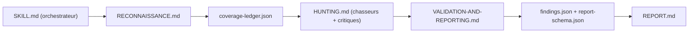

# cloudflare/security-audit-skill

> Skill pour agent de code qui audite la sécurité d'un dépôt en six phases, avec des agents isolés.

## Le problème
Un audit de sécurité fait à la main est long, et un seul agent qui « regarde le code » confirme trop vite ses propres pistes.

## Ce que ça fait vraiment
Le skill est surtout du prompt et des schémas. Il découpe l'audit en reconnaissance, chasse guidée par une grille de couverture, validation adverse de chaque candidat, sortie structurée, vérification indépendante puis rapports. Seuls deux validateurs Node sans dépendance (`validate-findings.cjs`, `validate-coverage-ledger.cjs`) sont du vrai code. Les verdicts sont `confirmed`, `needs_validation` ou `rejected`. Plusieurs passages sur le même dépôt s'additionnent.

## Comment c'est branché


## Essayer
```bash
npx skills add https://github.com/cloudflare/security-audit-skill \
  --skill security-audit
```
Puis, dans l'agent : `security audit this codebase`.

## Coût et pièges
Beaucoup de sous-agents en parallèle : la facture de jetons est à ta charge, et le README ne la chiffre pas. Le code cible ne doit être exécuté que dans un bac à sable qui coupe le réseau ; sans lui, la piste reste `needs_validation`.

## Ce que ce n'est pas
Ce n'est pas le harnais de flotte de Cloudflare, seulement son point de départ pour un seul dépôt. Ce n'est pas un scanner déterministe : les résultats dépendent du modèle. Le README avance que plusieurs passages trouvent environ le double d'un seul, sans preuve fournie ici.

## Alternatives
Aucune alternative nommée dans le README.

## Pour toi
À surveiller : la méthode (validation adverse, grille de couverture) mérite d'être copiée pour auditer du code d'agents ou de pipelines, mais le coût en jetons et le bac à sable obligatoire demandent un essai mesuré avant de l'adopter.

