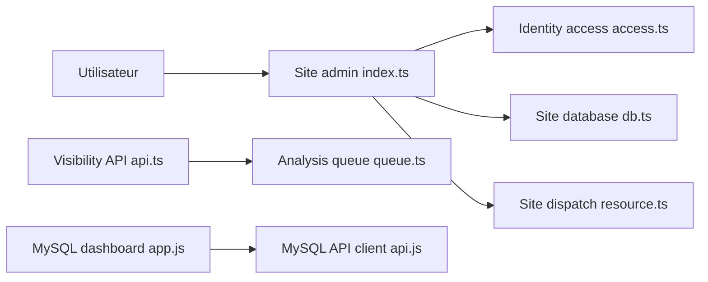

# cloudflare/templates

> Collection officielle de modèles de départ pour applications full-stack sur Cloudflare Workers.

## Le problème
Démarrer une application sur Workers demande d'assembler configuration, liaisons et déploiement. Un modèle prêt évite de partir de zéro.

## Ce que ça fait vraiment
Le dépôt regroupe des dossiers `*-template`, chacun avec son script `dev`. Selon l'architecture relevée, on y trouve notamment l'hébergement de sites avec administration, une plateforme multi-locataires, un rapport de visibilité IA avec file d'analyse, des tableaux de bord MySQL/Postgres et une démo de workflow. Une suite Playwright teste chaque modèle, en local ou sur la version déployée.

## Comment c'est branché


## Essayer
```bash
npm create cloudflare@latest
pnpm create cloudflare@latest
yarn create cloudflare@latest
pnpm run test:e2e
pnpm run test:e2e:live
```

## Coût et pièges
Le dépôt est gratuit (MIT), mais le déploiement suppose un compte Cloudflare ; les services utilisés (base, file, IA) peuvent être facturés selon l'offre. 197 issues ouvertes.

## Ce que ce n'est pas
Pas une application unique ni un framework : des exemples de départ, couplés à la plateforme Cloudflare. Le graphe ne couvre qu'une partie des modèles.

## Alternatives
- Aucune alternative citée dans le README.

## Pour toi
À surveiller : utile pour prototyper une API ou un tableau de bord léger sur Workers, mais sans intérêt direct si ta chaîne data / IA n'est pas déjà chez Cloudflare.

