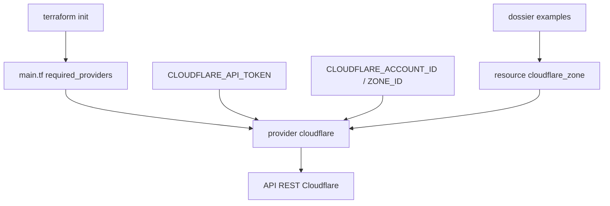

# cloudflare/terraform-provider-cloudflare

> Fournisseur Terraform officiel qui expose l'API REST Cloudflare en ressources déclaratives.

## Le problème
Configurer zones, DNS, règles et certificats à la main dans le tableau de bord Cloudflare ne laisse ni trace ni possibilité de revue.
Reproduire une configuration sur un second compte devient un exercice de recopie.

## Ce que ça fait vraiment
Déclare la source `cloudflare/cloudflare` dans `required_providers`, puis chaque objet Cloudflare devient une ressource HCL (`cloudflare_zone`, etc.).
Quatre schémas d'authentification : jeton d'API (recommandé), clé globale plus e-mail, clé de service utilisateur pour les certificats Origin CA.
`account_id` et `zone_id` peuvent être fixés au niveau du fournisseur pour toutes les requêtes concernées.
Chaque option a sa variable d'environnement équivalente, ce que le README recommande pour les valeurs sensibles.

## Comment c'est branché


## Essayer
```hcl
terraform {
  required_providers {
    cloudflare = {
      source  = "cloudflare/cloudflare"
      version = "~> 5.24.0"
    }
  }
}
```
Puis `terraform init` dans le répertoire.

## Coût et pièges
Terraform CLI 1.0 minimum. Un compte Cloudflare et un jeton d'API sont indispensables.
Les exemples du README contiennent des jetons et clés en clair : à ne jamais reproduire, les variables d'environnement existent pour ça.

## Ce que ce n'est pas
Pas un projet communautaire : le code est **auto-généré** et maintenu en interne, et les pull requests externes ne sont plus acceptées.
Pas un SemVer strict : des changements incompatibles peuvent sortir en version mineure, sur les internes publics non documentés et sur ce qui est jugé sans impact majoritaire.
Beaucoup de tickets sont suivis hors GitHub, sur des systèmes internes Cloudflare.

## Alternatives
Aucune alternative nommée dans le README.

## Pour toi
Pertinent seulement si ton infrastructure passe par Cloudflare ; rien à en tirer côté data ou ML.
