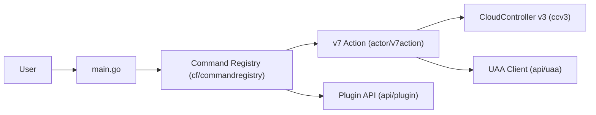

# cloudfoundry/cli

> Client en ligne de commande officiel de Cloud Foundry, pour développeurs et opérateurs de cette plateforme.

## Le problème
Pousser et administrer des applications sur une plateforme Cloud Foundry sans client dédié oblige à appeler l'API à la main.

## Ce que ça fait vraiment
La commande `cf` se connecte à l'API Cloud Controller (v3 pour la v8), à UAA, au routeur et à Log Cache : login, push d'app, orgs, rôles, ssh, plugins. D'après le code, Go, patron Command, couche « actor » entre commandes et clients API. Les v6 et v7 ne sont plus maintenues.

## Comment c'est branché


## Essayer
```bash
cf help -a
```
Le README renvoie à la page de téléchargement pour l'installation ; aucune autre commande n'y est donnée.

## Coût et pièges
Gratuit, mais inutile sans un environnement Cloud Foundry accessible. Problèmes connus sous Windows (Cygwin, Git Bash) pour `cf login` et `cf ssh`.

## Ce que ce n'est pas
Pas une plateforme : c'est seulement le client. Ce n'est pas un outil de données ou de ML.

## Alternatives
Aucune alternative nommée dans le README.

## Pour toi
À ignorer, sauf si ton entreprise déploie sur Cloud Foundry : rien ici ne sert un travail data ou MLOps courant.

