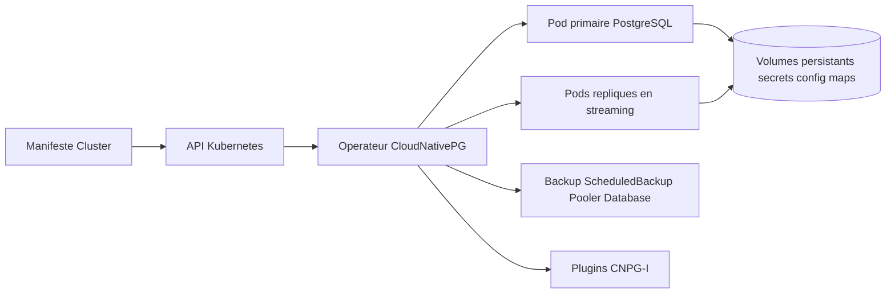

# cloudnative-pg/cloudnative-pg

> **A Kubernetes operator that runs PostgreSQL inside the cluster, for platform teams and DBAs.**

## The problem

Running PostgreSQL on Kubernetes usually means stacking an external high-availability tool —
the README names Patroni, repmgr and Stolon — on top of Kubernetes resources. The real state
of the database then lives outside the Kubernetes API, and failover, replica scaling and
image upgrades stay manual DBA work.

## What it actually does

The operator continuously reconciles a primary/standby PostgreSQL cluster declared in a
`Cluster` resource. The README lists what it automates: electing a new primary when the
current one fails and updating cluster status, provisioning or removing persistent volumes,
secrets and config maps when the desired replica count changes while managing streaming
replication, keeping service endpoints current, and rolling updates that refresh replica
pods first before a controlled switchover of the primary. It also manages `Backup`,
`ClusterImageCatalog`, `Database`, `ImageCatalog`, `Pooler`, `Publication`, `ScheduledBackup`
and `Subscription` resources. Application containers are immutable: an update replaces the
image rather than mutating a running container.

## How it is wired



The README names no source file, so the diagram only shows the parts it describes.
Kubernetes stays the single source of truth: cluster status is readable straight from the
`Cluster` resource through the Kubernetes API, and the operator is the only writer towards
pods and derived resources. Extension goes through the CNPG-I plugin interface, in the
separate `cloudnative-pg/cnpg-i` repository.

## Trying it

```bash
# No installation command is given in the README.
# It points to the Quickstart Guide: https://cloudnative-pg.io/docs/devel/quickstart/
```

The README has no `kubectl apply`, no Helm command and no build line: everything is delegated
to the documentation site. Nothing is reconstructed here.

## Cost and traps

The code is Apache-2.0 and the project is a CNCF sandbox project: no paid licence, no API key.
The real cost is elsewhere: you need a working vanilla Kubernetes cluster, persistent storage,
and skills on both sides at once — the README claims a tool "designed by PostgreSQL experts
for Kubernetes administrators". The README also links a commercial support page, and the
project was originally built and sponsored by EDB: governance sits in a foundation, paid
support sits with a vendor. Reading trap: the README is long but explains almost nothing
operational — no install, no configuration, no version prerequisites — so every real decision
requires the external docs.

## What it is not

It is not a general-purpose database operator: the README explicitly rules out other engines,
with MariaDB as the counter-example. It does not support PostgreSQL forks either — fork
features are only considered if they fit as extensions or pluggable frameworks — nor
Kubernetes distributions other than CNCF vanilla Kubernetes. Finally it is not a managed
service: nobody operates the cluster for you, the operator automates gestures, it does not
take the pager.

## Alternatives

- `zalando/postgres-operator`: the other PostgreSQL operator for Kubernetes in the catalogue;
  prefer it if the Patroni ecosystem, which CloudNativePG deliberately avoids, is already in
  place.
- The high-availability tools named in the README — Patroni, repmgr, Stolon — remain the
  classic route outside Kubernetes or on virtual machines.
- `VictoriaMetrics/VictoriaMetrics` and `netdata/netdata`, among the supplied neighbours, are
  not comparable: they are observability components, not database management.

## For you

If your data pipelines, feature stores or MLflow metadata sit on PostgreSQL and the platform
already runs on Kubernetes, this is the most GitOps-friendly way to stop treating the database
as a pet outside the cluster. If you have no Kubernetes, or your PostgreSQL is a managed cloud
service, skip it.
