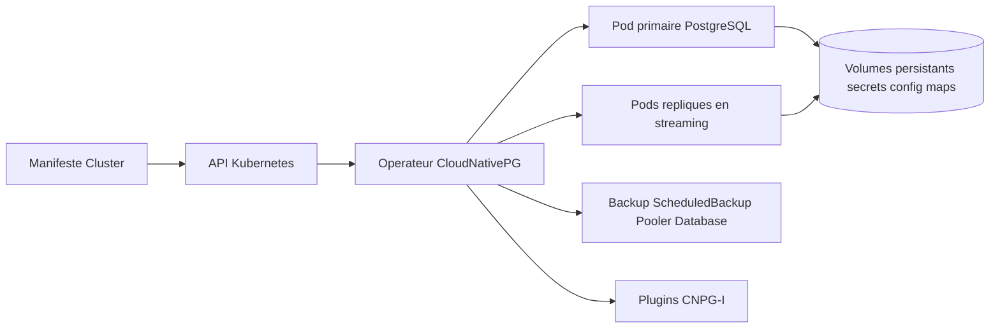

# cloudnative-pg/cloudnative-pg

> **Un opérateur Kubernetes qui fait vivre PostgreSQL dans le cluster, pour équipes plateforme et DBA.**

## Le problème

Faire tourner PostgreSQL dans Kubernetes oblige d'ordinaire à empiler un outil de haute
disponibilité externe — le README cite Patroni, repmgr, Stolon — au-dessus des ressources
Kubernetes. L'état réel de la base vit alors ailleurs que dans l'API Kubernetes, et le
bascule de primaire, les répliques, les mises à jour d'image restent des gestes manuels de DBA.

## Ce que ça fait vraiment

L'opérateur réconcilie en continu l'état d'un cluster PostgreSQL primaire/standby décrit
dans une ressource `Cluster`. Le README énumère les actions qu'il automatise : élection d'un
nouveau primaire quand l'actuel tombe et mise à jour du statut, provisionnement ou retrait
des volumes persistants, secrets et config maps quand le nombre de répliques change, avec
gestion de la réplication en streaming, maintien à jour des endpoints de service, et mise à
jour roulante (répliques d'abord, puis switchover contrôlé du primaire) quand l'image change.
Il gère aussi les ressources `Backup`, `ClusterImageCatalog`, `Database`, `ImageCatalog`,
`Pooler`, `Publication`, `ScheduledBackup` et `Subscription`. Les conteneurs applicatifs sont
immuables : une mise à jour remplace l'image, elle ne modifie pas le conteneur en place.

## Comment c'est branché



Le README ne nomme aucun fichier du code : le schéma reprend seulement les pièces qu'il
décrit. Kubernetes reste la source de vérité unique ; le statut du cluster PostgreSQL est
lisible directement dans la ressource `Cluster` via l'API Kubernetes, et l'opérateur est le
seul à écrire vers les pods et les ressources dérivées. L'extension passe par l'interface de
plugins CNPG-I, dans le dépôt séparé `cloudnative-pg/cnpg-i`.

## Essayer

```bash
# Aucune commande d'installation n'est donnée dans le README.
# Il renvoie vers le Quickstart Guide : https://cloudnative-pg.io/docs/devel/quickstart/
```

Le README ne contient ni `kubectl apply`, ni commande Helm, ni ligne de build : tout est
délégué au site de documentation. Rien n'est reconstruit ici.

## Coût et pièges

Le code est sous Apache-2.0 et le projet est un projet sandbox de la CNCF : pas de licence
payante ni de clé d'API. Le vrai coût est ailleurs : il faut un cluster Kubernetes vanilla
en état de marche, du stockage persistant, et les compétences des deux mondes à la fois —
le README revendique un outil « conçu par des experts PostgreSQL pour des administrateurs
Kubernetes ». Le README renvoie par ailleurs vers une page de support commercial, et le
projet a été construit et sponsorisé à l'origine par EDB : la gouvernance est en fondation,
l'assistance payante reste chez un éditeur. Piège de lecture : le README est long mais
n'explique presque rien d'opérationnel — pas d'installation, pas de configuration, pas de
prérequis de version — il faut ouvrir la documentation externe pour toute décision réelle.

## Ce que ce n'est pas

Ce n'est pas un opérateur de bases de données générique : le README exclut explicitement
les autres moteurs, MariaDB est cité en contre-exemple. Ce n'est pas non plus compatible
avec les forks de PostgreSQL — les fonctionnalités des forks ne seront considérées que si
elles passent par une extension ou un cadre enfichable — ni avec les distributions
Kubernetes autres que le Kubernetes vanilla de la CNCF. Enfin, ce n'est pas un service
géré : personne n'exploite le cluster à votre place, l'opérateur automatise des gestes,
il ne prend pas l'astreinte.

## Alternatives

- `zalando/postgres-operator` : l'autre opérateur PostgreSQL pour Kubernetes du catalogue ;
  à préférer si l'écosystème Patroni, que CloudNativePG a justement choisi de ne pas
  utiliser, est déjà en place chez vous.
- Les outils de haute disponibilité cités dans le README — Patroni, repmgr, Stolon — restent
  la voie classique hors Kubernetes ou en machines virtuelles.
- `VictoriaMetrics/VictoriaMetrics` et `netdata/netdata`, parmi les voisins fournis, ne sont
  pas comparables : ce sont des briques d'observabilité, pas de gestion de bases.

## Pour toi

Si vos pipelines de données, vos feature stores ou vos métadonnées MLflow s'appuient sur
PostgreSQL et que la plateforme est déjà sur Kubernetes, c'est la façon la plus GitOps de
ne plus traiter la base comme un animal de compagnie hors cluster. Si vous n'avez pas de
Kubernetes, ou si votre PostgreSQL est un service managé chez un cloud, passez votre chemin.
