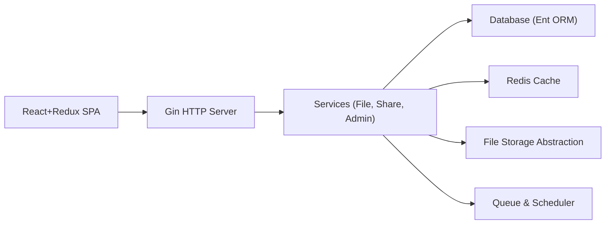

# cloudreve/Cloudreve

> Système de gestion de fichiers auto-hébergé, multi-utilisateurs, avec stockage local ou cloud multiple.

## Le problème
Héberger ses propres fichiers avec partage, prévisualisation et WebDAV oblige à assembler plusieurs outils, et chaque fournisseur de stockage a son API.

## Ce que ça fait vraiment
Serveur Go (Gin, Ent) avec front React embarqué. Une couche d'abstraction de stockage (pkg/filemanager) pilote le disque local, un nœud distant, OneDrive, S3, Qiniu, OSS, COS, OBS, KS3 ou Upyun. Il ajoute des téléchargements en arrière-plan via Aria2/qBittorrent, un WebDAV, des liens de partage avec expiration, des groupes d'utilisateurs et l'édition en ligne de documents.

## Comment c'est branché

## Essayer
Le README ne fournit pas de commande ; il renvoie à la documentation « Getting started » pour le déploiement local, et à « Build » pour compiler depuis les sources.

## Coût et pièges
Gratuit en soi ; le stockage cloud choisi reste à ta charge. Le README ne détaille pas les prérequis d'installation. Licence GPL-3.0 : contraintes de redistribution si tu modifies et diffuses.

## Ce que ce n'est pas
Ce n'est pas un outil de données ou de ML. Ce n'est pas un simple explorateur : il embarque une base, un cache et une file de tâches à opérer.

## Alternatives
- Aucune alternative nommée dans le README.

## Pour toi
Surveiller : utile pour un partage de fichiers d'équipe auto-hébergé, mais hors du cœur data/IA ; à évaluer seulement si tu as ce besoin d'infrastructure.

