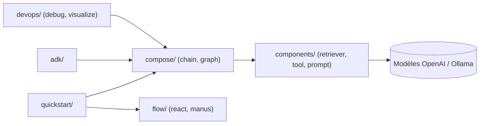

# cloudwego/eino-examples

> Recueil d'exemples Go pour le framework d'agents LLM Eino : agents, orchestration, RAG et outils.

## Le problème
Apprendre un framework d'agents demande des exemples exécutables couvrant agents, graphes d'orchestration et composants, pas seulement une référence d'API.

## Ce que ça fait vraiment
Organise des exemples par thème : ADK (agents, workflows, transfert, humain dans la boucle, multi-agents), compose (chaînes, graphes, workflows), flow (ReAct, Manus, Deer-Go), composants (retrievers, outils, MCP, parseurs) et quickstart (chat, assistant RAG complet, agent Todo, tutoriel en 11 chapitres). Des outils de débogage et de visualisation Mermaid sont inclus.

## Comment c'est branché

## Essayer
Le README ne donne pas de commande : chaque exemple est décrit dans COOKBOOK.md.

## Coût et pièges
Les exemples appellent des LLM (OpenAI, Ollama d'après le code) : clés et facture à ta charge. L'assistant Eino s'appuie sur Redis ou la mémoire.

## Ce que ce n'est pas
Ce n'est pas le framework lui-même (dépôt `cloudwego/eino`) ni une application prête à déployer.

## Alternatives
- cloudwego/eino-ext : extensions du framework.
- cloudwego/eino : le framework de base.

## Pour toi
À surveiller : bonne mine d'exemples si tu construis des agents en Go ; peu utile si ta pile est Python.

