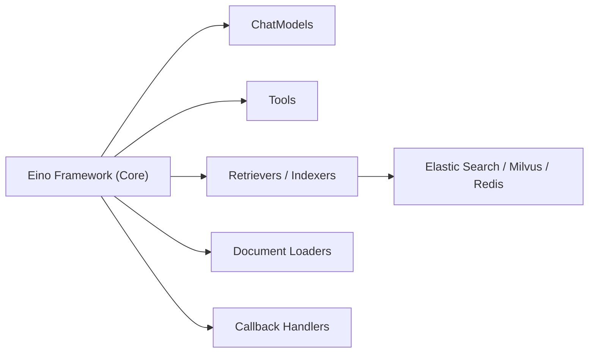

# cloudwego/eino-ext

> Extensions officielles du framework Go Eino : modèles, outils, retrievers, loaders et callbacks pour applications LLM.

## Le problème
Un framework LLM ne sert à rien sans implémentations concrètes de modèles, de bases vectorielles et d'outils.

## Ce que ça fait vraiment
Dépôt de modules Go, un par type de composant Eino : ChatModel (OpenAI, Claude, Gemini, Ark, Ollama…), Tool (Google Search, DuckDuckGo…), Retriever et Indexer (Elasticsearch, Milvus, Redis, VikingDB), Embedding, Document Loader (S3, URL, fichier), Transformer. Contient aussi des callbacks (traçage Langfuse) et des outils DevOps (plugin IDE pour le débogage visuel).

## Comment c'est branché

## Essayer
Aucune commande documentée dans le README.

## Coût et pièges
Chaque implémentation exige son service tiers (clés d'API, bases) ; 124 issues ouvertes. Le README ne détaille ni installation ni exemples.

## Ce que ce n'est pas
Pas le framework Eino lui-même, qui vit ailleurs ; pas utilisable seul. Ce sont des Go modules.

## Alternatives
Aucune alternative citée dans le README.

## Pour toi
À ignorer sauf si tu construis déjà sur Eino en Go : sans ce framework, ces extensions n'ont pas d'usage propre.
