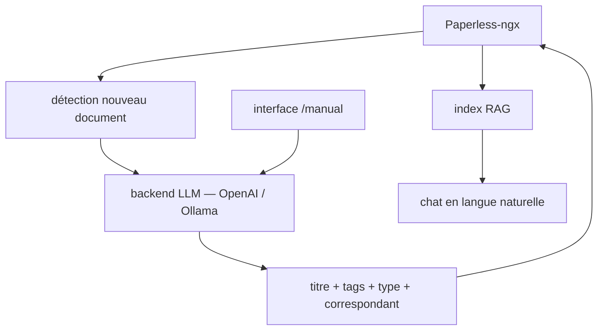

# clusterzx/paperless-ai

> Extension Paperless-ngx qui classe, étiquette et interroge tes documents via un LLM.

## Le problème
Paperless-ngx archive les documents mais laisse le titre, les tags, le type et le correspondant à remplir à la main.
Retrouver « le montant de la dernière facture d'électricité » suppose de connaître le mot-clé exact.

## Ce que ça fait vraiment
Il détecte les nouveaux documents dans Paperless-ngx, analyse le contenu et assigne titre, tags, type et correspondant automatiquement.
Les backends acceptés sont OpenAI-compatibles ou Ollama : Mistral, Llama, Phi-3, Gemma-2, DeepSeek, OpenRouter, Perplexity, Together, LiteLLM, VLLM, Fastchat, Gemini.
Un chat RAG répond en langue naturelle sur l'ensemble de l'archive, avec le contexte complet du document plutôt que des mots-clés.
Un mode manuel (`/manual`) permet de traiter les documents sensibles un par un, et des règles limitent le périmètre traité.

## Comment c'est branché


## Essayer
```bash
# développement local
npm install
npm run test
```
L'installation de production n'est pas documentée dans le README : elle renvoie au wiki. Un redémarrage du conteneur après configuration est exigé pour construire l'index RAG.

## Coût et pièges
Chaque document traité est un appel LLM : avec OpenAI la facture suit le volume d'archive, Ollama la ramène à zéro mais demande une machine.
Un Paperless-ngx fonctionnel est un prérequis dur, et le premier démarrage impose un redémarrage manuel du conteneur.

## Ce que ce n'est pas
Ce n'est pas un projet vivant : le mainteneur annonce en tête de README qu'il n'assure plus le suivi, qu'il réécrit la base de code le soir et qu'il n'est pas sûr de finir.
Ce n'est pas non plus un remplacement de Paperless-ngx, qui prépare sa propre intégration IA officielle — mentionnée par l'auteur comme raison possible d'arrêter.

## Alternatives
- Paperless-ngx lui-même : son intégration IA officielle est annoncée dans le README comme le successeur probable.
- Ollama : cité comme backend local, si le sujet est d'éviter d'envoyer les documents à un tiers.

## Pour toi
À écarter : le README annonce l'abandon et l'amont prépare la même fonction ; garde l'idée, pas le dépôt.
