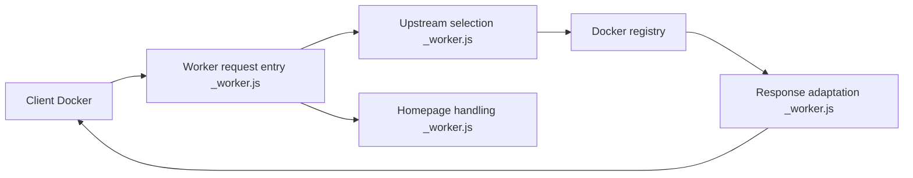

# cmliu/CF-Workers-docker.io

> Worker Cloudflare qui relaie les requêtes vers les registres Docker, pour contourner des restrictions d'accès.

## Le problème
Dans certaines régions, Docker Hub et d'autres registres sont lents ou inaccessibles. Un miroir personnel permet de tirer les images.

## Ce que ça fait vraiment
Un fichier `_worker.js` reçoit les requêtes d'un client Docker, choisit le registre amont (selon le chemin ou le nom d'hôte), puis adapte la réponse. Des variables règlent la page d'accueil (redirection 302, faux site, filtrage par User-Agent). Le README ajoute des exemples de config Docker, containerd et Podman, et une liste de miroirs tiers non vérifiés.

## Comment c'est branché


## Essayer
```bash
docker pull docker.fxxk.dedyn.io/library/nginx:stable-alpine3.19-perl
```
Le domaine d'exemple est indiqué comme pollué : déployer son propre Worker (copie de `_worker.js` ou déploiement Pages depuis un fork).

## Coût et pièges
Compte Cloudflare requis. Le README avertit qu'un usage de type proxy peut enfreindre les conditions de Cloudflare (risque de suspension), et que le mode par nom d'hôte peut faire classer le domaine comme hameçonnage.

## Ce que ce n'est pas
Pas un service géré : dépôt archivé depuis 2025, sans licence déclarée, donc droits de réutilisation flous. Les miroirs listés n'ont subi aucun contrôle de sécurité.

## Alternatives
- Les miroirs tiers listés dans le README (DaoCloud, 1panel…) : rien à déployer, mais confiance à accorder.

## Pour toi
À ignorer : archivé, sans licence et risqué côté conditions Cloudflare ; un registre miroir officiel ou interne convient mieux pour une chaîne MLOps.

