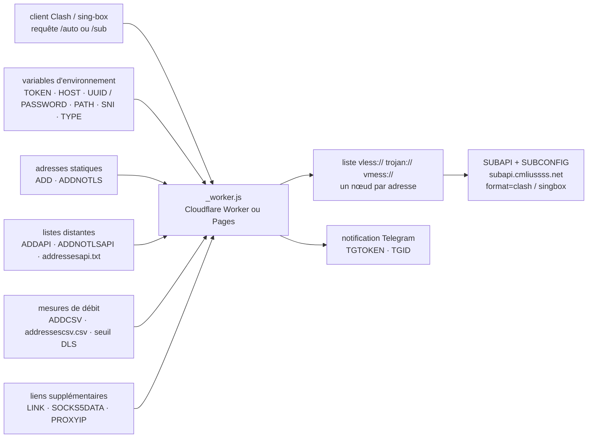

# cmliu/WorkerVless2sub

> **A proxy subscription generator hosted on Cloudflare Workers, for users of VLESS/Trojan clients.**

## The problem

A proxy client (Clash, sing-box, v2rayN) consumes a subscription link: a URL that returns a list
of nodes. When traffic goes through Cloudflare's CDN, the entry address that actually performs
well changes often — lists of speed-tested "preferred IPs" are published and refreshed
continuously. Without an intermediary, you rewrite by hand, on every change, as many
configuration lines as there are addresses, each repeating the same host, UUID and WebSocket
path.

## What it actually does

The repository is a single file, `_worker.js`, pasted into a Cloudflare Worker or deployed
through Cloudflare Pages from a fork. Once online it exposes two HTTP entries: `/auto` (the path
is set by the `TOKEN` variable), which returns a subscription built from the nodes described in
environment variables, and `/sub?host=…&uuid=…&path=…`, which builds a subscription on the fly
for a node passed as URL parameters.

The project's own work is bulk substitution: it takes *one* node (front host `HOST`, `UUID` for
VLESS or `PASSWORD` for Trojan, `PATH`, plus optional `SNI`, `TYPE`, `ALPN`, `SCV`) and repeats
it across *n* entry addresses. Those addresses come from three sources that stack: `ADD`/
`ADDNOTLS` (a static list, `#` introduces the alias), `ADDAPI`/`ADDNOTLSAPI` (URLs of plain-text
address files, refetched on every request) and `ADDCSV` (iptest speed-measurement results in CSV,
filtered by the `DLS` threshold — the README states the number is compared without regard to its
unit).

On top of that: a home page where you paste a node link to get a subscription in one click, a
rotating-UUID mode (`KEY`, `TIME`, `UPTIME` — rotation at 3 a.m. Beijing time by default),
ProxyIP assignment (`PROXYIP`, `PROXYIPAPI`, and `CMPROXYIPS`, which maps a ProxyIP to a region
recognised from a `#HK` suffix), a SOCKS5 pool (`SOCKS5DATA`), a Telegram notification on access
(`TGTOKEN`, `TGID`), and page styling (`ICO`, `PNG`, `IMG`, `SUBNAME`, `BEIAN`, `URL302`, `URL`).

Conversion to Clash and sing-box (`?format=clash`, `?format=singbox`) is **not** done here: it is
delegated to an external conversion backend, `SUBAPI`, defaulting to `subapi.cmliussss.net`, with
the rule file `SUBCONFIG` (a remote ACL4SSR file by default).

## How it is wired



No code-derived diagram exists for this repository: the graph above is reconstructed from the
README alone. The only source file it names is `_worker.js`; everything else it lists from the
repository is data (`addressesapi.txt`, `addressesipv6api.txt`, `addressescsv.csv`, `socks5Data`).

## Trying it

The README contains **no shell command**: everything happens in the Cloudflare console. The two
documented routes, in order:

- **Pages**: fork the repository, then in the Cloudflare Pages console `连接到 Git` → pick
  `WorkerVless2sub` → `开始设置`; bind a subdomain (never the apex domain) under the `自定义域`
  tab, adding a CNAME to `WorkerVless2sub.pages.dev` at your DNS provider; then declare the
  variables.
- **Workers**: create a Worker and paste the contents of `_worker.js` into it; then declare the
  variables. On this route the README also documents editing the script's arrays directly:

```js
let addresses = [
	'icook.tw:2053#优选域名',
	'cloudflare.cfgo.cc#优选官方线路',
	'185.221.160.203:443#电信优选IP',
];
```

```js
let DLS = 4;//速度下限
let addressescsv = [
	'https://raw.githubusercontent.com/cmliu/WorkerVless2sub/main/addressescsv.csv',
 	'https://raw.githubusercontent.com/cmliu/WorkerVless2sub/main/addressescsv.csv',
];
```

The usage URLs, exactly as given:

```url
https://sub.cmliussss.workers.dev/auto
https://sub.cmliussss.workers.dev/sub?host=edgetunnel-2z2.pages.dev&uuid=30e9c5c8-ed28-4cd9-b008-dc67277f8b02&path=/?ed=2560&sni=www.10068.cn&type=splithttp
https://sub.cmliussss.workers.dev/sub?host=hbpb.us.kg&pw=bpb-trojan&path=/tr?ed=2560
https://sub.cmliussss.workers.dev/auto?format=clash
https://sub.cmliussss.workers.dev/auto?format=singbox
```

The README stresses one point: the manual subscription path must contain `/sub`.

## Cost and traps

- **A Cloudflare account is required**, plus a domain name if you want a custom one — the README
  mandates a subdomain (`sub.example.tld`), not the apex. The repository costs nothing; the
  Workers request quota does.
- **The project is an avowedly public service.** A warning at the top of the README says *not* to
  put a private node in the `LINK` variable: everyone would reach it. `TOKEN` is the only barrier
  in front of `/auto`, and its default value is `auto`.
- **External dependencies at request time**: the `ADDAPI`/`ADDCSV` lists are refetched from
  third-party URLs, so are the ProxyIP and SOCKS5 pool, and Clash/sing-box conversion goes out to
  `SUBAPI` (`subapi.cmliussss.net` by default, a backend provided by a sponsor named in the
  README). Each of those URLs sees your requests and can disappear.
- **`TGTOKEN`/`TGID` send a Telegram notification** on every subscription access: that is usage
  reporting, worth knowing before enabling it.
- **Variables that contradict each other**: `UUID` and `PASSWORD` conflict, `PASSWORD` wins;
  `KEY` disables `UUID`. The README says so, but nothing prevents it.
- **The README is Chinese only**, including the quoted Cloudflare interface labels, and the
  tutorials are YouTube videos. There is no English version.
- **Legal framing and platform policy**: circumventing network filtering is the user's own
  liability, and running a proxy relay on a free Cloudflare account runs into the platform's
  terms of use. The README addresses neither.

## What it is not

- **It is not a proxy.** It carries no traffic: it *writes configuration lists*. The tunnel
  itself lives elsewhere — the examples point at an `edgetunnel-*.pages.dev`, a separate project.
- **It is not a subscription converter.** `format=clash` and `format=singbox` are handed to a
  third-party backend; with no reachable `SUBAPI`, those formats do not come out.
- **It is not a speed tester**: `ADDCSV` consumes a CSV produced elsewhere (iptest), and `DLS`
  only filters an already-measured number. The Worker measures nothing.
- **It is not a tool for private nodes**: it is designed around shared nodes, as the README's
  warning states. Putting a personal node in it means publishing it.
- **It is not data, AI or MLOps tooling** despite appearing in a watch catalogue: this is
  networking, in a filtering-circumvention context.

## Alternatives

The batch line offers **no neighbours** for this repository, so no comparison comes from the
catalogue. The README names three projects in its credits or URLs, only two of which are of a
comparable kind:

| | When to prefer it |
|---|---|
| **cmliu/CFcdnVmess2sub** | By the same author, referenced through an `ADDNOTLSAPI` URL: the VMess-oriented predecessor. Worth a look if that is the protocol you use. |
| **6Kmfi6HP/EDtunnel** | Credited among the borrowed code: this is the *tunnel* side — what actually carries the traffic, which WorkerVless2sub merely describes. Complementary rather than alternative. |
| **ACL4SSR/ACL4SSR** | Credited as the source of the default `SUBCONFIG`: Clash rule files, not a generator. Take it if all you need is routing. |

## For you

Ignore it for a data / AI / MLOps profile: the subject is network-filtering circumvention, far
from any professional use of models or data, and deploying it puts your Cloudflare account and
your own liability on the line. The only transferable value is in reading it: 6,000 stars for a
single file driven by some thirty environment variables is a case study in what an edge worker
allows — worth comparing against a classic proxy deployment if you are weighing that execution
model.
