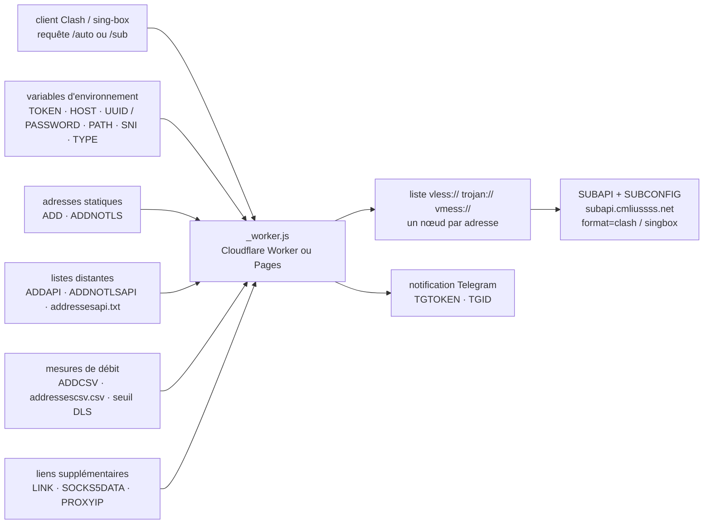

# cmliu/WorkerVless2sub

> **Générateur d'abonnements proxy hébergé sur Cloudflare Workers, pour utilisateurs de clients VLESS/Trojan.**

## Le problème

Un client proxy (Clash, sing-box, v2rayN) consomme un lien d'abonnement : une URL qui rend une
liste de nœuds. Quand on passe par le CDN de Cloudflare, l'adresse d'entrée efficace change
souvent — les listes d'« IP優選 » (adresses retenues après test de débit) sont publiées et
renouvelées en continu. Sans intermédiaire, il faut recomposer à la main, à chaque changement,
autant de lignes de configuration que d'adresses, en y recopiant le même domaine, le même UUID
et le même chemin WebSocket.

## Ce que ça fait vraiment

Le dépôt tient dans un seul fichier, `_worker.js`, à coller dans un Worker Cloudflare ou à
déployer via Cloudflare Pages depuis un fork. Une fois en ligne, il expose deux entrées HTTP :
`/auto` (le chemin est réglé par la variable `TOKEN`), qui rend l'abonnement construit à partir
des nœuds décrits par les variables d'environnement, et `/sub?host=…&uuid=…&path=…`, qui
construit un abonnement à la volée pour un nœud passé en paramètres d'URL.

Le travail propre au projet est la substitution en masse : il prend *un* nœud (domaine de
façade `HOST`, `UUID` pour VLESS ou `PASSWORD` pour Trojan, `PATH`, plus `SNI`, `TYPE`, `ALPN`,
`SCV` en option) et le décline sur *n* adresses d'entrée. Ces adresses viennent de trois sources
cumulables : `ADD`/`ADDNOTLS` (liste statique, `#` pour l'alias), `ADDAPI`/`ADDNOTLSAPI` (URL de
fichiers texte d'adresses, rechargés à chaque requête) et `ADDCSV` (résultats de mesure iptest
au format CSV, filtrés par le seuil de débit `DLS` — le README précise que le nombre est comparé
sans tenir compte de l'unité).

S'y ajoutent : une page d'accueil où l'on colle un lien de nœud pour obtenir l'abonnement en un
clic, un mode UUID tournant (`KEY`, `TIME`, `UPTIME` — rotation à 3 h, heure de Pékin, par
défaut), l'attribution d'un ProxyIP (`PROXYIP`, `PROXYIPAPI`, `CMPROXYIPS` qui associe un ProxyIP
à une région repérée par suffixe `#HK`), un pool SOCKS5 (`SOCKS5DATA`), une notification Telegram
à chaque accès (`TGTOKEN`, `TGID`), et l'habillage de la page (`ICO`, `PNG`, `IMG`, `SUBNAME`,
`BEIAN`, `URL302`, `URL`).

La conversion vers Clash et sing-box (`?format=clash`, `?format=singbox`) n'est **pas** faite
ici : elle est déléguée à un backend de conversion externe, `SUBAPI`, par défaut
`subapi.cmliussss.net`, avec le fichier de règles `SUBCONFIG` (par défaut un ACL4SSR distant).

## Comment c'est branché



Aucun diagramme tiré du code n'existe pour ce dépôt : ce schéma est reconstruit depuis le seul
README. Le seul fichier de code qu'il nomme est `_worker.js` ; tout le reste du dépôt cité est
de la donnée (`addressesapi.txt`, `addressesipv6api.txt`, `addressescsv.csv`, `socks5Data`).

## Essayer

Le README ne donne **aucune commande shell** : tout se fait par l'interface Cloudflare. Les deux
voies documentées, dans l'ordre :

- **Pages** : forker le dépôt, puis dans la console Cloudflare Pages `连接到 Git` → choisir
  `WorkerVless2sub` → `开始设置` ; lier un sous-domaine (jamais le domaine racine) via l'onglet
  `自定义域`, en ajoutant chez son DNS un CNAME vers `WorkerVless2sub.pages.dev` ; puis déclarer
  les variables.
- **Workers** : créer un Worker et y coller le contenu de `_worker.js` ; puis déclarer les
  variables. Dans cette voie, le README décrit aussi l'édition directe des tableaux du script :

```js
let addresses = [
	'icook.tw:2053#优选域名',
	'cloudflare.cfgo.cc#优选官方线路',
	'185.221.160.203:443#电信优选IP',
];
```

```js
let DLS = 4;//速度下限
let addressescsv = [
	'https://raw.githubusercontent.com/cmliu/WorkerVless2sub/main/addressescsv.csv',
 	'https://raw.githubusercontent.com/cmliu/WorkerVless2sub/main/addressescsv.csv',
];
```

Les URL d'usage, telles que données :

```url
https://sub.cmliussss.workers.dev/auto
https://sub.cmliussss.workers.dev/sub?host=edgetunnel-2z2.pages.dev&uuid=30e9c5c8-ed28-4cd9-b008-dc67277f8b02&path=/?ed=2560&sni=www.10068.cn&type=splithttp
https://sub.cmliussss.workers.dev/sub?host=hbpb.us.kg&pw=bpb-trojan&path=/tr?ed=2560
https://sub.cmliussss.workers.dev/auto?format=clash
https://sub.cmliussss.workers.dev/auto?format=singbox
```

Le README insiste sur un point : le chemin de l'abonnement manuel doit contenir `/sub`.

## Coût et pièges

- **Compte Cloudflare obligatoire**, plus un nom de domaine si l'on veut un domaine
  personnalisé — le README impose un sous-domaine (`sub.exemple.tld`), pas le domaine racine.
  Le dépôt lui-même ne coûte rien ; le quota de requêtes Workers, si.
- **Le dépôt est un service public assumé.** Un avertissement en tête de README dit de ne
  **pas** mettre de nœud privé dans la variable `LINK` : tout le monde y accéderait. `TOKEN` est
  la seule barrière devant `/auto`, et sa valeur par défaut est `auto`.
- **Dépendances externes au moment de la requête** : les listes `ADDAPI`/`ADDCSV` sont
  rechargées depuis des URL tierces, le ProxyIP et le pool SOCKS5 aussi, et la conversion
  Clash/sing-box part chez `SUBAPI` (`subapi.cmliussss.net` par défaut, backend offert par un
  sponsor nommé dans le README). Chacune de ces URL voit passer vos requêtes et peut disparaître.
- **`TGTOKEN`/`TGID` envoient une notification Telegram** à chaque accès à l'abonnement : c'est
  une remontée d'usage, à connaître avant de l'activer.
- **Variables qui se contredisent** : `UUID` et `PASSWORD` sont en conflit, `PASSWORD` gagne ;
  `KEY` désactive `UUID`. Le README le signale, mais rien ne l'empêche.
- **README en chinois uniquement**, y compris les libellés d'interface Cloudflare cités, et les
  tutoriels sont des vidéos YouTube. Pas de version anglaise.
- **Cadre légal et politiques d'usage** : contourner un filtrage réseau engage l'utilisateur, et
  faire tourner un relais de proxy sur un compte Cloudflare gratuit se heurte aux conditions
  d'utilisation de la plateforme. Le README n'aborde ni l'un ni l'autre.

## Ce que ce n'est pas

- **Ce n'est pas un proxy.** Il ne transporte aucun trafic : il *écrit des listes de
  configuration*. Le tunnel lui-même est ailleurs — les exemples pointent vers un
  `edgetunnel-*.pages.dev`, qui est un autre projet.
- **Ce n'est pas un convertisseur d'abonnement.** `format=clash` et `format=singbox` sont
  renvoyés à un backend tiers ; sans `SUBAPI` joignable, ces formats ne sortent pas.
- **Ce n'est pas un testeur de débit** : `ADDCSV` consomme un CSV produit ailleurs (iptest), et
  `DLS` ne fait que filtrer un nombre déjà mesuré. Aucune mesure n'est faite par le Worker.
- **Ce n'est pas un outil pour nœuds privés** : le projet est pensé pour des nœuds partagés, le
  README le rappelle en avertissement. Y mettre un nœud personnel, c'est le publier.
- **Ce n'est pas de l'outillage data, IA ou MLOps** malgré sa présence dans un catalogue de
  veille : c'est du réseau, dans un contexte de contournement de filtrage.

## Alternatives

La ligne du lot ne propose **aucun voisin** pour ce dépôt, donc aucune comparaison ne vient du
catalogue. Le README nomme trois projets dans ses remerciements ou ses URL, dont deux seulement
sont de même nature :

| | Quand le préférer |
|---|---|
| **cmliu/CFcdnVmess2sub** | Du même auteur, cité via une URL `ADDNOTLSAPI` : le prédécesseur orienté VMess. À regarder si c'est ce protocole-là qu'on utilise. |
| **6Kmfi6HP/EDtunnel** | Cité dans les emprunts de code : c'est le côté *tunnel* — ce qui fait passer le trafic, que WorkerVless2sub se contente de décrire. Complémentaire plutôt qu'alternatif. |
| **ACL4SSR/ACL4SSR** | Cité comme source du `SUBCONFIG` par défaut : des fichiers de règles Clash, pas un générateur. À prendre si le besoin est seulement le routage. |

## Pour toi

À ignorer pour un profil data / IA / MLOps : le sujet est le contournement de filtrage réseau,
sans rapport avec un usage professionnel de modèles ou de données, et le déployer engage votre
compte Cloudflare et votre responsabilité. Le seul intérêt transférable est de lecture : 6 000
étoiles pour un fichier unique piloté par une trentaine de variables d'environnement, c'est un
cas d'école de ce que permet un worker de bord — à comparer à un déploiement de proxy classique
si vous vous interrogez sur ce modèle d'exécution.
