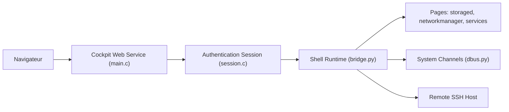

# cockpit-project/cockpit

> Interface web d'administration de serveurs Linux, qui ouvre une vraie session système dans le navigateur.

## Le problème
Administrer un serveur (services, stockage, réseau, journaux, conteneurs) oblige à jongler entre terminal et outils disparates.

## Ce que ça fait vraiment
Cockpit expose dans le navigateur des pages d'administration : services et logs, stockage, configuration réseau, comptes, applications, métriques, kdump, dépannage SELinux. Elles pilotent le système via un pont (`bridge.py`) et des canaux D-Bus ; le service web authentifie, puis tu peux ajouter d'autres machines Cockpit par SSH. Terminal et web restent cohérents : un service lancé d'un côté est visible de l'autre.

## Comment c'est branché

## Essayer
Aucune commande documentée : le README indique que Cockpit est empaqueté sous le nom `cockpit` dans de nombreuses distributions et renvoie au guide d'installation du site du projet ; un client Flatpak « Cockpit Client » existe.

## Coût et pièges
Gratuit. Certains systèmes demandent un travail supplémentaire (voir la FAQ du projet). Une console web d'administration ouvre une surface d'attaque : lire SECURITY.md avant d'exposer le service.

## Ce que ce n'est pas
Ce n'est pas un outil d'orchestration multi-clusters ni de supervision d'ML. C'est un panneau d'administration par machine, sur Linux.

## Alternatives
Le README ne nomme aucune alternative.

## Pour toi
Surveiller : pratique pour administrer un serveur GPU ou un poste de calcul sans mémoriser les commandes, mais la licence est absente du catalogue GitHub ; à vérifier avant un déploiement en entreprise.

