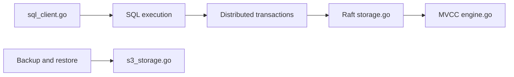

# cockroachdb/cockroach

> Base SQL distribuée compatible PostgreSQL, tolérante aux pannes, pour applications devant passer à l'échelle.

## Le problème
Une base SQL mono-nœud plafonne et tombe avec sa machine. Répliquer et rééquilibrer à la main est lourd.

## Ce que ça fait vraiment
Expose une API SQL (protocole PostgreSQL) au-dessus d'un magasin clé-valeur répliqué par Raft, avec transactions ACID fortement cohérentes. Monte en charge horizontalement et survit aux pannes de disque, machine, rack ou datacenter. Gère aussi backup/restore, changefeeds, réplication entre clusters, stockage cloud (S3) et suivi de jobs.

## Comment c'est branché


## Essayer
```bash
# Aucune commande shell dans ce README : installer un exécutable précompilé
# ou compiler depuis les sources (voir le wiki), démarrer un cluster local,
# puis s'y connecter avec le client SQL intégré.
```

## Coût et pièges
Une offre gérée (CockroachCloud) existe, avec cluster gratuit. Depuis le 18 novembre 2024 (v24.3 et suivantes), les versions sortent sous la CockroachDB Software License (CSL), que GitHub ne reconnaît pas.

## Ce que ce n'est pas
Ce n'est pas du logiciel libre classique : les versions récentes relèvent d'une licence maison. Ce n'est pas non plus une base analytique.

## Alternatives
Non documenté : le README renvoie à une page de comparaison sans nommer de dépôt.

## Pour toi
Surveiller : solide pour du SQL distribué, mais lis la CSL avant tout usage commercial ; un profil data/MLOps y touchera rarement directement.

