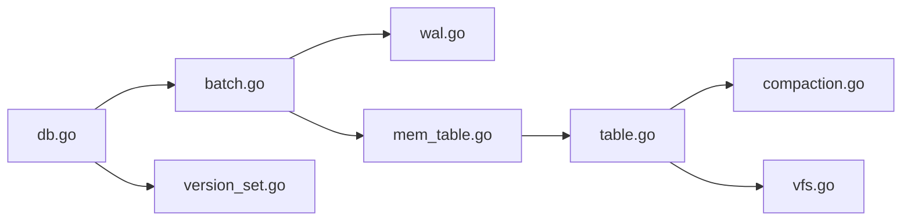

# cockroachdb/pebble

> Moteur clé-valeur LSM en Go, inspiré de RocksDB, moteur de stockage de CockroachDB.

## Le problème
Embarquer RocksDB dans un programme Go impose cgo et une surface de fonctionnalités énorme dont on n'utilise qu'une partie.

## Ce que ça fait vraiment
Store LSM embarqué : WAL, memtable, SSTables, manifeste versionné, compactions par niveaux.
Batches indexés, snapshots, itération inverse, filtres bloom, range deletions, range keys, ingestion de SSTables.
Versions de format majeures avec migrations irréversibles.
CLI `pebble` pour inspecter, rejouer et benchmarker une base.

## Comment c'est branché


## Essayer
```bash
go run github.com/cockroachdb/pebble/cmd/pebble@v1.1.3 db upgrade <db-dir>
```
L'usage normal est un `import "github.com/cockroachdb/pebble"` (exemple Go dans le README).

## Coût et pièges
Gratuit. Peut corrompre silencieusement une base RocksDB utilisant une fonctionnalité non prise en charge.

## Ce que ce n'est pas
Pas un RocksDB complet : ni transactions, ni column families, ni sauvegardes. La v2+ n'ouvre plus les bases RocksDB.

## Alternatives
- facebook/rocksdb : l'original C++, bien plus complet.
- google/leveldb : l'ancêtre, plus simple.

## Pour toi
À ignorer pour un profil data/IA : excellent moteur, mais il ne sert que si tu écris toi-même une base de données en Go.
