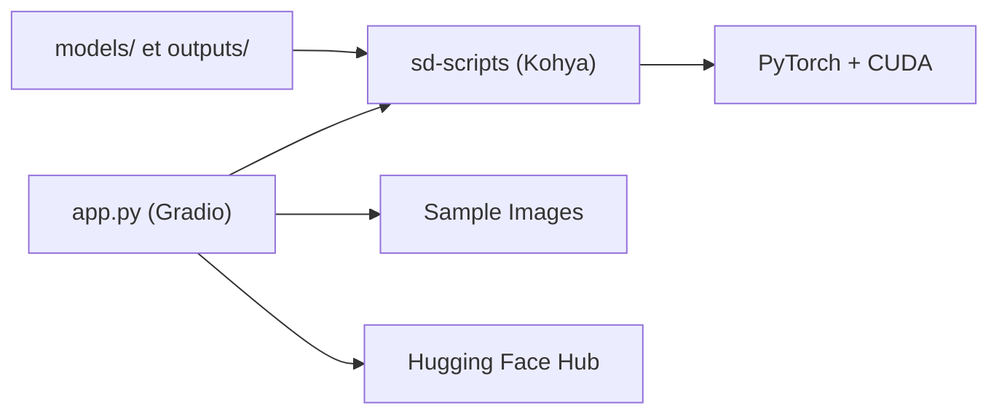

# cocktailpeanut/fluxgym

> Interface web Gradio pour entraîner des LoRA FLUX sur GPU de 12 à 20 Go, sans terminal.

## Le problème
Les scripts Kohya entraînent bien FLUX mais se pilotent en ligne de commande ; AI-Toolkit a une interface simple mais exige 24 Go de VRAM.

## Ce que ça fait vraiment
Interface Gradio (issue d'AI-Toolkit) au-dessus des scripts `kohya-ss/sd-scripts` (branche `sd3`). Tu saisis les infos du LoRA, téléverses des images et légendes (ou fichiers `.txt` du même nom), puis lances. Options : images d'échantillon tous les N pas, onglet avancé construit à partir des flags Kohya, publication sur Hugging Face avec un jeton stocké dans `HF_TOKEN`.

## Comment c'est branché


## Essayer
```bash
git clone https://github.com/cocktailpeanut/fluxgym
cd fluxgym
git clone -b sd3 https://github.com/kohya-ss/sd-scripts
python -m venv env && source env/bin/activate
cd sd-scripts && pip install -r requirements.txt
cd .. && pip install -r requirements.txt
pip install --pre torch torchvision torchaudio --index-url https://download.pytorch.org/whl/cu121
python app.py
```

## Coût et pièges
GPU NVIDIA requis ; PyTorch nightly imposé (cu128 pour les RTX 50). Docker possible (`docker compose up -d --build`). 414 issues ouvertes.

## Ce que ce n'est pas
Pas un générateur d'images : il n'entraîne que des LoRA. Reproductibilité fragile (dépendance à une branche et à un nightly).

## Alternatives
AI-Toolkit (plus simple mais 24 Go) et les scripts Kohya en ligne de commande.

## Pour toi
Surveiller : pratique si tu fais du fine-tuning d'images en local, mais ta pile n'est pas centrée génération d'images.
