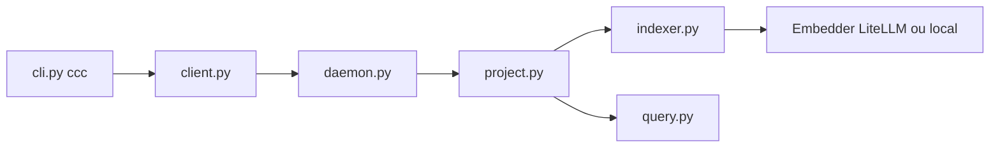

# cocoindex-io/cocoindex-code

> Recherche sémantique de code par AST, en CLI, skill ou serveur MCP pour agents de codage.

## Le problème
Les agents de codage retrouvent mal le code par description avec grep et consomment beaucoup de jetons à lire des fichiers entiers.

## Ce que ça fait vraiment
Le CLI `ccc` découpe les fichiers (par AST, chunkers personnalisables), calcule des embeddings et les stocke dans un index SQLite. Un démon en arrière-plan gère les projets. Recherche par requête naturelle, filtres langage/chemin, et `ccc grep` pour une recherche structurelle sans index. S'intègre par skill, plugin (Claude Code, Grok, Oh My Pi) ou MCP. Embeddings locaux (sentence-transformers) ou cloud via LiteLLM.

## Comment c'est branché


## Essayer
```bash
pipx install 'cocoindex-code[full]'
ccc init
ccc index
ccc search "authentication logic"
claude mcp add cocoindex-code -- ccc mcp
```

## Coût et pièges
Le mode `[full]` tire environ 1 Go (torch). Sans lui, une clé d'API d'embedding est requise. Télémétrie anonyme active par défaut ; désactivable avec `COCOINDEX_DISABLE_USAGE_TRACKING=1`. Le démon garde le modèle en RAM. Changer de modèle impose de réindexer.

## Ce que ce n'est pas
L'annonce « 70 % de jetons économisés » n'est pas démontrée dans le README. `ccc grep` dépend d'une fonction de CocoIndex pas encore publiée : il faut une version locale. Sur Docker Mac, l'inférence locale est CPU uniquement.

## Alternatives
Aucune alternative nommée dans le README.

## Pour toi
Adopter à l'essai : un index sémantique local branché en MCP améliore le travail d'un agent sur de gros dépôts, avec une télémétrie facile à couper.

