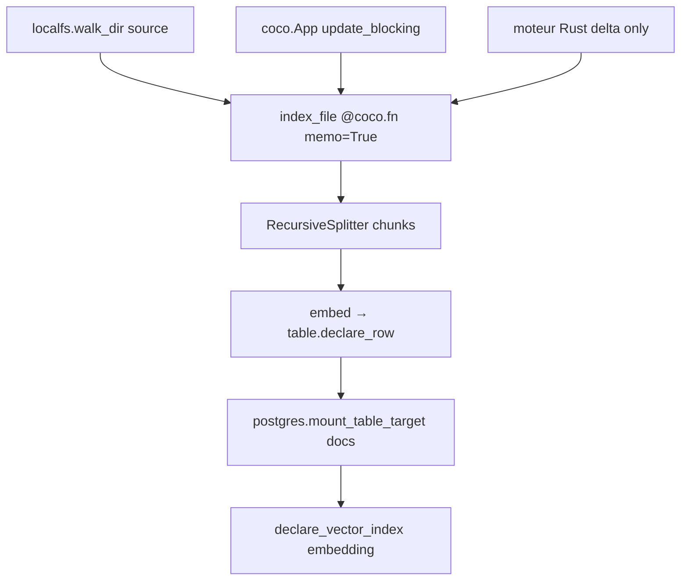

# cocoindex-io/cocoindex

> Cadre Python déclaratif d'indexation incrémentale, pour maintenir un index vectoriel toujours à jour.

## Le problème
Un index de RAG se périme dès que la source change, et le réindexer entièrement à chaque cycle coûte cher en embeddings.
Détecter soi-même le delta, le propager à travers jointures et retirer les lignes obsolètes est un travail d'ingénierie de données à part entière.

## Ce que ça fait vraiment
On déclare *ce qui doit se trouver* dans la cible ; le moteur recalcule le delta et garde la cible synchronisée.
`@coco.fn(memo=True)` met en cache par hash de l'entrée **et** hash du code, donc changer la fonction invalide ce qu'il faut.
Connecteurs et opérateurs fournis : `localfs.walk_dir`, `postgres.mount_table_target`, `RecursiveSplitter`, déclaration d'index vectoriel sur une colonne.
Quand une source change, il identifie les enregistrements touchés, propage à travers jointures et lookups, met à jour la cible et retire les lignes périmées.

## Comment c'est branché


## Essayer
```sh
pip install -U cocoindex
```

## Coût et pièges
La bibliothèque est gratuite ; il faut une cible, ici PostgreSQL, donc un service à héberger.
Le README annonce une offre CocoIndex Enterprise pour l'échelle : la frontière fonctionnelle n'est pas détaillée.

## Ce que ce n'est pas
Pas une base vectorielle : elle écrit dans la vôtre (PostgreSQL dans l'exemple).
Pas un cadre d'agents : elle fournit le contexte frais, pas l'orchestration.
Pas du pur Python : le cœur est en Rust, ce qui limite ce qu'on peut modifier soi-même.

## Alternatives
Aucune alternative nommée ; le README ne cite que ses propres connecteurs et un skill pour agents de code.

## Pour toi
La bonne réponse au réindexage complet : si tu maintiens un index RAG vivant, c'est à tester sur un corpus réel.
