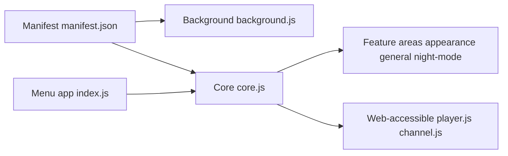

# code-charity/youtube

> Extension de navigateur qui ajoute environ 80 réglages à l'interface de YouTube.

## Le problème
L'interface YouTube n'offre pas de contrôle fin sur le lecteur, l'apparence ou le filtrage de contenu.

## Ce que ça fait vraiment
Un manifeste charge un `background.js`, des scripts de contenu (`core.js`, `init.js`) et des modules par zone de YouTube, plus des scripts accessibles à la page (`player.js`, `blocklist.js`, `themes.js`). Un menu de réglages est bâti sur la bibliothèque maison Satus. Traductions gérées via Crowdin.

## Comment c'est branché

## Essayer
Aucune commande documentée dans le README fourni.

## Coût et pièges
Gratuit. La licence est présente mais non reconnue par GitHub. 1 484 issues ouvertes. Dépend des changements de l'interface YouTube.

## Ce que ce n'est pas
Ce n'est pas un téléchargeur. Le README contient surtout des slogans (« only YouTube extension you'll ever need ») et très peu de matière technique.

## Alternatives
Aucune alternative nommée dans le README.

## Pour toi
À ignorer : amélioration de confort pour YouTube, sans rapport avec ton travail data/IA.

