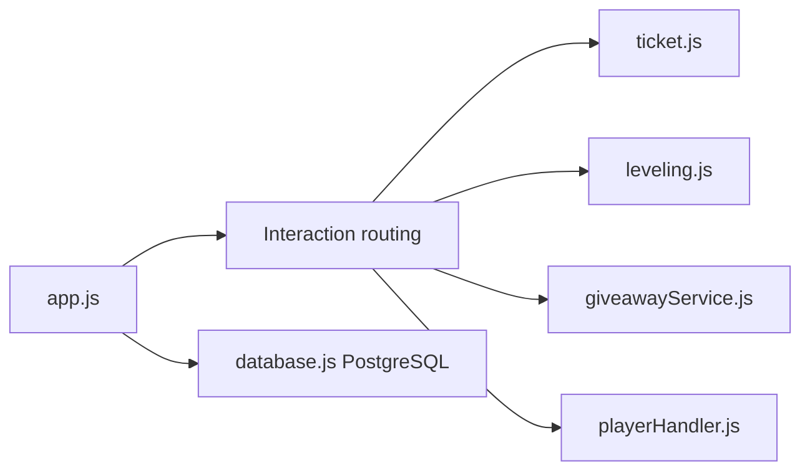

# codebymitch/TitanBot

> Bot Discord tout-en-un : modération, économie, tickets, niveaux, musique, pour administrateurs de serveur.

## Le problème
Gérer un serveur Discord demande de multiplier des bots pour la modération, les tickets, les niveaux et les annonces.

## Ce que ça fait vraiment
Un seul bot Node.js couvre modération (actions de masse, notes, cas), économie et boutique, tickets avec transcriptions, compteurs de serveur, rôles par réaction, XP et rôles de niveau, tirages au sort, anniversaires, accueil et musique via Lavalink. Les données sont isolées par serveur dans PostgreSQL.

## Comment c'est branché


## Essayer
```bash
git clone https://github.com/codebymitch/TitanBot.git
cd TitanBot
cp .env.example .env
docker compose up -d --build
curl http://localhost:3000/health
```

## Coût et pièges
Jeton de bot Discord (`DISCORD_TOKEN`, `CLIENT_ID`, `GUILD_ID`) ; PostgreSQL inclus par Docker. La musique utilise par défaut des nœuds Lavalink publics tiers. Intents et permissions étendus demandés, dont bannir et gérer les rôles.

## Ce que ce n'est pas
Ce n'est pas un projet data ou IA. Les commandes globales peuvent mettre environ une heure à se propager.

## Alternatives
Non documenté : le README cite seulement Musicify comme point de comparaison pour la musique.

## Pour toi
Ignorer : hors sujet pour un profil data/IA/MLOps, à un seul mainteneur et avec des permissions Discord très larges.

