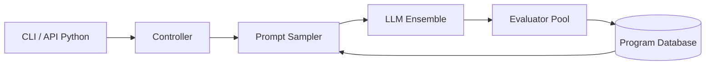

# codelion/openevolve

> Agent de code évolutionnaire qui fait améliorer un programme par des LLM selon un évaluateur.

## Le problème
Optimiser un algorithme ou un noyau demande de nombreux essais manuels guidés par des mesures.

## Ce que ça fait vraiment
Boucle inspirée d'AlphaEvolve : échantillonnage de prompt à partir des programmes passés, génération par un ensemble de LLM, évaluation par ton évaluateur, stockage dans une base MAP-Elites avec plusieurs îlots. Les artefacts (stderr, retours) alimentent la génération suivante. Reproductible par graine. Exemples : minimisation de fonction, noyaux Metal, tri Rust, régression symbolique, optimisation de prompts.

## Comment c'est branché


## Essayer
```bash
pip install openevolve
python openevolve-run.py examples/function_minimization/initial_program.py \
  examples/function_minimization/evaluator.py \
  --config examples/function_minimization/config.yaml \
  --iterations 50
```

## Coût et pièges
Le README estime de 0,01 à 0,60 $ par itération selon le modèle, à ta charge ; modèles locaux possibles. Il faut écrire un évaluateur fiable. Les gains (2,8×, +23 % de précision) sont ceux de l'auteur.

## Ce que ce n'est pas
Pas une découverte autonome garantie : la qualité dépend du message système et de l'évaluateur. Le README emploie un ton promotionnel, non repris ici.

## Alternatives
OptiLLM est cité comme proxy complémentaire, pas comme concurrent.

## Pour toi
À surveiller : utile pour l'optimisation de code ou de prompts mesurable, si tu sais écrire un bon évaluateur et budgéter les appels.
