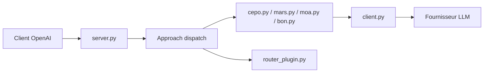

# codelion/optillm

> Proxy compatible API OpenAI qui applique des techniques de raisonnement à l'inférence pour améliorer les réponses.

## Le problème
Améliorer l'exactitude d'un LLM existant (maths, code, logique) sans le réentraîner.

## Ce que ça fait vraiment
Un serveur local reçoit les requêtes au format OpenAI et applique une technique choisie par préfixe de modèle (`moa-gpt-4o-mini`), par champ `optillm_approach` ou par balise dans le prompt : MARS, CePO, PlanSearch, best-of-N, MCTS, self-consistency, etc. Des plugins ajoutent mémoire, confidentialité (anonymisation), lecture d'URL, exécution de code, client MCP et recherche approfondie. Passe par LiteLLM pour les autres fournisseurs et inclut un serveur d'inférence local.

## Comment c'est branché


## Essayer
```bash
pip install optillm
export OPENAI_API_KEY="your-key-here"
optillm
```
Puis pointer un client OpenAI sur `http://localhost:8000/v1` avec un modèle préfixé (`moa-gpt-4o-mini`).

## Coût et pièges
Chaque technique multiplie les appels au modèle, donc la facture. Par défaut, le serveur écoute en local (`127.0.0.1`) ; `--host 0.0.0.0` demande une clé `--optillm-api-key`. Anthropic, llama.cpp et ollama n'acceptent pas plusieurs réponses, ce qui limite les techniques disponibles.

## Ce que ce n'est pas
Pas une garantie de gain : les résultats du README sont ceux de l'auteur, sur des benchmarks précis, et pas tous reproduits par des tiers.

## Alternatives
- LiteLLM : proxy pour les fournisseurs non compatibles OpenAI, cité dans le README.

## Pour toi
À surveiller : utile pour tester des stratégies de raisonnement sur tes propres évaluations, en mesurant le surcoût en tokens avant d'y croire.

