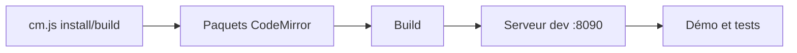

# codemirror/dev

> Dépôt de développement de CodeMirror : suivi des bugs et scripts pour travailler sur ses paquets.

## Le problème
CodeMirror est découpé en nombreux paquets npm ; contribuer suppose de les cloner et builder ensemble.

## Ce que ça fait vraiment
`bin/cm.js install` clone les paquets, installe les dépendances et compile ; `bin/cm.js build` recompile tout ; `npm run dev` lance un serveur (port 8090) avec démo et tests navigateur. Le README annonce le déménagement vers code.haverbeke.berlin ; ce dépôt est archivé.

## Comment c'est branché


## Essayer
```bash
node bin/cm.js install
node bin/cm.js build
npm run dev
```

## Coût et pièges
Gratuit ; Node 16 requis. Dépôt archivé : plus de mises à jour ici. Licence présente mais non identifiée.

## Ce que ce n'est pas
Ce n'est pas pour utiliser CodeMirror : le README dit d'installer les paquets npm séparés.

## Alternatives
Le nouveau dépôt annoncé : https://code.haverbeke.berlin/codemirror/dev.

## Pour toi
Ignorer : dépôt archivé et déménagé, et éditeur de code web hors périmètre.

