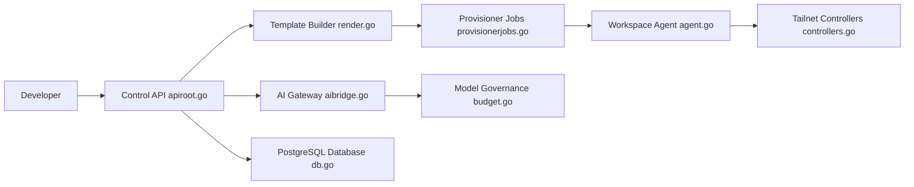

# coder/coder

> Plateforme auto-hébergée d'environnements de dev cloud définis en Terraform, avec agents IA de code.

## Le problème
Onboarder des devs prend des jours, les machines tournent à vide, et les clés LLM finissent copiées dans chaque poste.

## Ce que ça fait vraiment
Workspaces décrits en templates Terraform (VM EC2, pods Kubernetes, conteneurs Docker), reliés par tunnel WireGuard.
Arrêt automatique des ressources inactives.
« Coder Agents » : boucle d'agent IA exécutée dans le plan de contrôle, sans clé LLM dans les workspaces ; AI Gateway pour auth, audit et budget.
Connexion IDE (VS Code, JetBrains), devcontainers, serveur MCP par workspace.

## Comment c'est branché


## Essayer
```bash
curl -L https://coder.com/install.sh | sh
coder server
coder server --postgres-url <url> --access-url <url>
```

## Coût et pièges
Production : PostgreSQL ≥ 13 et URL d'accès externe ; infra de workspaces à ta charge. Fonctions « Premium » payantes.

## Ce que ce n'est pas
Pas un IDE : il provisionne l'infra où tournent tes IDE. Sans base externe, mode évaluation seulement (`*.try.coder.app`).

## Alternatives
Aucune alternative nommée dans le README.

## Pour toi
À surveiller : pertinent pour offrir des workspaces GPU standardisés à une équipe ML, lourd pour un usage solo.
