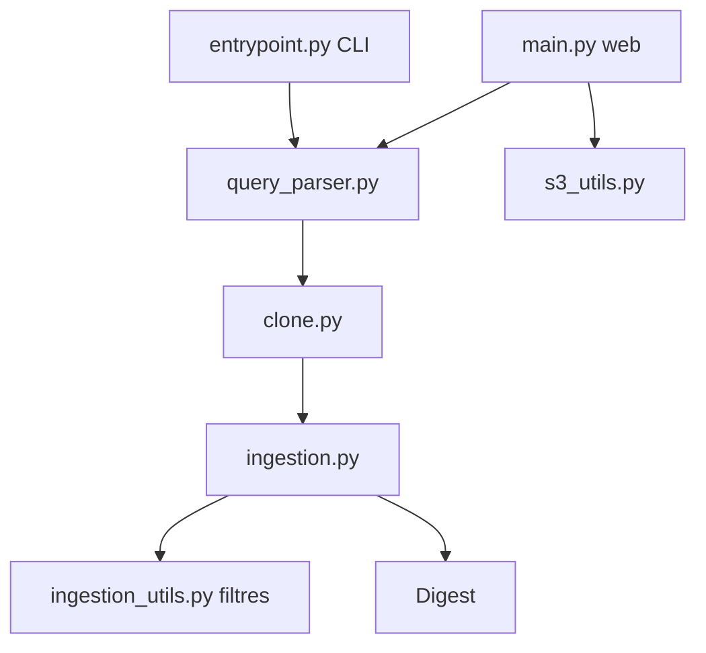

# coderamp-labs/gitingest

> Transforme un dépôt Git ou un dossier en un seul texte prêt à coller dans un prompt LLM.

## Le problème
Donner le contexte d'un dépôt à un LLM oblige à copier des fichiers un par un, sans structure ni idée du nombre de tokens.

## Ce que ça fait vraiment
À partir d'une URL GitHub (y compris un sous-dossier) ou d'un dossier local, il produit l'arborescence et le contenu des fichiers, avec la taille et le nombre de tokens (tiktoken).
Il respecte `.gitignore`, accepte les jetons pour les dépôts privés et les sous-modules.
Il s'utilise en CLI (`digest.txt` ou stdout), en paquet Python sync ou async (Jupyter), via une extension de navigateur ou un serveur FastAPI auto-hébergé.

## Comment c'est branché


## Essayer
```bash
pip install gitingest
pipx install gitingest
gitingest /path/to/directory
gitingest https://github.com/coderamp-labs/gitingest
docker build -t gitingest .
docker run -d --name gitingest -p 8000:8000 gitingest
```

## Coût et pièges
C'est gratuit. La version serveur embarque PostHog et Sentry, qui envoie les PII par défaut (`SEND_DEFAULT_PII=true`) quand il est activé.

## Ce que ce n'est pas
Ce n'est pas un index sémantique ni un RAG : c'est un simple dump texte, qui dépasse vite la fenêtre de contexte sur un gros dépôt.

## Alternatives
- Repomix : l'équivalent en JavaScript/npm.

## Pour toi
À adopter : `pip install` puis une seule commande pour donner un dépôt entier à un LLM. Un gain de temps immédiat pour relire du code ou le documenter.
