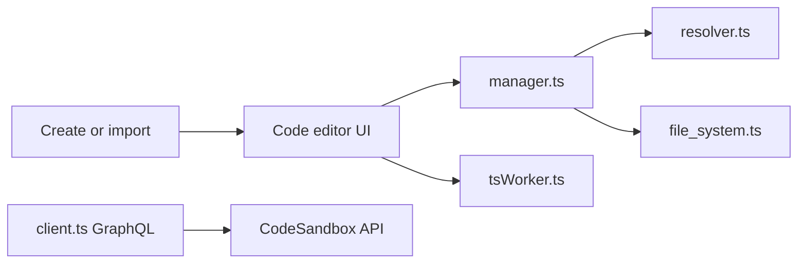

# codesandbox/codesandbox-client

> Client web de l'IDE en ligne CodeSandbox pour prototyper des applications web dans le navigateur.

## Le problème
Démarrer un environnement de développement web demande une installation locale avant d'écrire la première ligne.

## Ce que ça fait vraiment
Application web pour créer ou importer un projet, éditer et exécuter le code dans un bac à sable, puis le partager. Le gestionnaire de Sandpack résout les modules, récupère les dépendances et transpile ; BrowserFS et Monaco/TypeScript fournissent le système de fichiers et l'éditeur.

## Comment c'est branché


## Essayer
```bash
# Aucune commande documentée dans ce README :
# le produit s'utilise en ligne, la documentation est sur le site.
```

## Coût et pièges
Le client dépend de l'API CodeSandbox et d'autres serveurs, dont certains seulement sont open source. Licence non identifiée par GitHub.

## Ce que ce n'est pas
Ce n'est pas un IDE autonome auto-hébergeable : le README liste d'autres dépôts (serveur, nginx, git extractor, CLI).

## Alternatives
Non documenté : le README ne nomme pas d'alternative.

## Pour toi
Surveiller : utile comme référence d'IDE dans le navigateur, mais peu exploitable seul pour data/IA, et dépendant d'un service.

