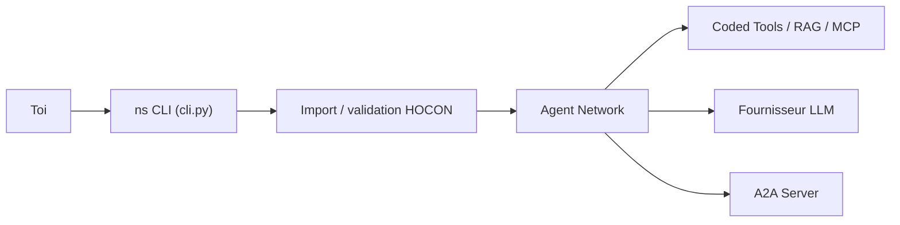

# cognizant-ai-lab/neuro-san-studio

> Terrain de jeu pour la bibliothèque Neuro SAN : réseaux d'agents décrits en HOCON, avec exemples et UI.

## Le problème
Assembler des systèmes multi-agents exige beaucoup de code, et les experts métier ne peuvent pas les configurer.

## Ce que ça fait vraiment
CLI `ns` qui crée un projet (`ns init`), importe des réseaux d'exemples, lance serveur et UI nsflow (`ns run`). Les réseaux d'agents sont déclarés en HOCON avec des outils Python (« coded tools »), MCP, A2A, RAG, et un méta-agent Agent Network Designer qui génère de nouveaux réseaux. Sly-data garde les données sensibles hors des LLM.

## Comment c'est branché


## Essayer
```bash
uv init
uv venv
source .venv/bin/activate
uv add neuro-san-studio
ns init
ns check-llm-keys
ns run
```

## Coût et pièges
Clé OpenAI, Anthropic ou Gemini requise (BYOK), donc facture LLM à ta charge. Serveur sur localhost:8080, UI sur :4173. 130 issues ouvertes. La section « High level Architecture » du README est vide.

## Ce que ce n'est pas
Pas un produit fini : c'est le studio d'exemples de la bibliothèque neuro-san, séparée. Les cas d'usage sont des démos.

## Alternatives
Le README mentionne CrewAI, LangChain, Agentforce et Agentspace comme écosystèmes intégrables, pas comme concurrents.

## Pour toi
À surveiller : intéressant pour prototyper vite du multi-agents déclaratif, moins si tu préfères du code Python pur.
