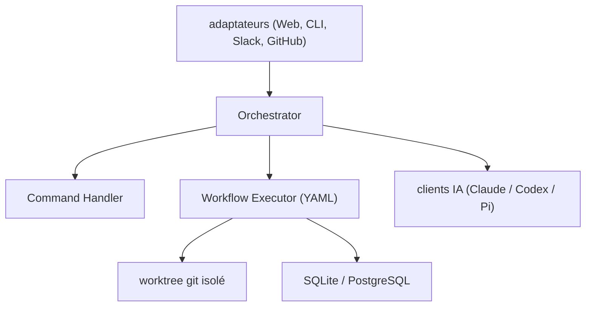

# coleam00/Archon

> Moteur de workflows YAML pour agents de code, afin de rendre leurs runs reproductibles.

## Le problème
Demander « corrige ce bug » à un agent donne un résultat différent à chaque exécution : il saute la
planification, oublie les tests, ignore le gabarit de PR. Rien n'est rejouable.

## Ce que ça fait vraiment
Des workflows décrits en YAML dans `.archon/workflows/` : des nœuds déterministes (`bash:`) et des
nœuds IA (`prompt:`), avec `depends_on`, des boucles `until: ALL_TASKS_COMPLETE`, des portes
humaines `interactive: true` et `fresh_context: true`. Chaque exécution obtient son propre worktree
git. 19 workflows livrés (`archon-idea-to-pr`, `archon-fix-github-issue`, `archon-smart-pr-review`…).
Adaptateurs Web UI, CLI, Telegram, Slack, Discord, GitHub ; état en SQLite ou PostgreSQL (14 tables).

## Comment c'est branché


## Essayer
```bash
git clone https://github.com/coleam00/Archon
cd Archon
bun install
claude
```
```bash
curl -fsSL https://archon.diy/install | bash
archon serve
archon workflow list
```

## Coût et pièges
Il faut Bun, la CLI GitHub et Claude Code installés séparément ; les binaires compilés exigent un
`CLAUDE_BIN_PATH` explicite. L'install rapide x64 réclame AVX2. La facture, c'est celle de l'agent
sous-jacent, multipliée par le nombre d'itérations de boucle. Télémétrie PostHog activée par défaut
(`ARCHON_TELEMETRY_DISABLED=1`, `DO_NOT_TRACK=1`).

## Ce que ce n'est pas
Pas un agent : Archon ordonne, l'intelligence vient de Claude Code, Codex ou Pi. Pas l'Archon d'avant —
la version Python (gestion de tâches + RAG) est archivée sur `archive/v1-task-management-rag`.
Pas à lancer depuis son propre dépôt : le README insiste, on travaille depuis le repo cible.

## Alternatives
- n8n : la comparaison revendiquée par le README, côté workflows généraux.

## Pour toi
L'idée du worktree par run et des portes de validation vaut d'être reprise, même sans adopter l'outil.
