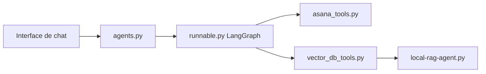

# coleam00/ai-agents-masterclass

> Code d'accompagnement d'une série de vidéos YouTube sur la construction d'agents IA.

## Le problème
Apprendre à construire des agents LLM avec des exemples suivis pas à pas.

## Ce que ça fait vraiment
Chaque dossier numéroté correspond à une vidéo (agent LangChain, LangGraph, RAG local, outils Asana, évaluation, interface de chat). D'autres dossiers sont du contenu annexe, dont un backend GoHighLevel. Les projets sont indépendants, chacun avec son `.env.example` et son `requirements.txt`.

## Comment c'est branché


## Essayer
```bash
python -m venv ai-agents-masterclass
cd 1-first-agent
pip install -r requirements.txt
python [script name].py
```

## Coût et pièges
Les exemples exigent des clés d'API (variables du `.env.example`). Dernier push le 2025-01-14, soit plus d'un an : dépendances probablement périmées.

## Ce que ce n'est pas
Pas une bibliothèque ni une application intégrée : des démos indépendantes, liées aux vidéos.

## Alternatives
Aucune alternative citée dans le README.

## Pour toi
À ignorer : support de formation non mis à jour depuis plus d'un an, alors que les outils d'agents bougent vite.

