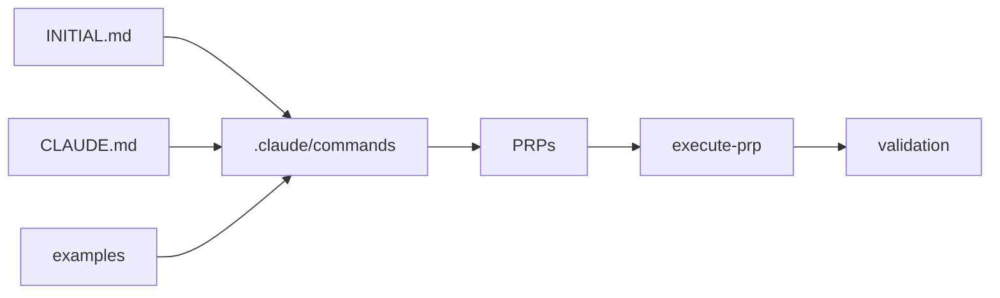

# coleam00/context-engineering-intro

> Gabarit de « context engineering » pour Claude Code : règles, exemples, PRP générés puis exécutés.

## Le problème
Un assistant de code échoue souvent faute de contexte : conventions, exemples et critères de validation manquent.

## Ce que ça fait vraiment
`CLAUDE.md` pose les règles globales ; `INITIAL.md` décrit la fonctionnalité voulue ; `examples/` sert de bibliothèque de motifs.
Commande `/generate-prp` : recherche le code et la doc, produit un PRP (Product Requirements Prompt) avec étapes et validations.
`/execute-prp` : implémente, teste, corrige jusqu'aux critères.
Dossiers `use-cases/` : agents Pydantic AI, agent RAG, serveur MCP Cloudflare.

## Comment c'est branché


## Essayer
```bash
git clone https://github.com/coleam00/Context-Engineering-Intro.git
cd Context-Engineering-Intro
/generate-prp INITIAL.md
/execute-prp PRPs/your-feature-name.md
```

## Coût et pièges
Gratuit ; suppose un abonnement ou une clé Claude Code.

## Ce que ce n'est pas
Pas un outil logiciel : une méthode et des fichiers modèles. Le « 10x mieux » du README est une opinion.

## Alternatives
Aucune alternative nommée dans le README.

## Pour toi
À surveiller : les commandes PRP sont un bon modèle pour tes propres skills Claude Code, à reprendre en partie plutôt qu'en bloc.
