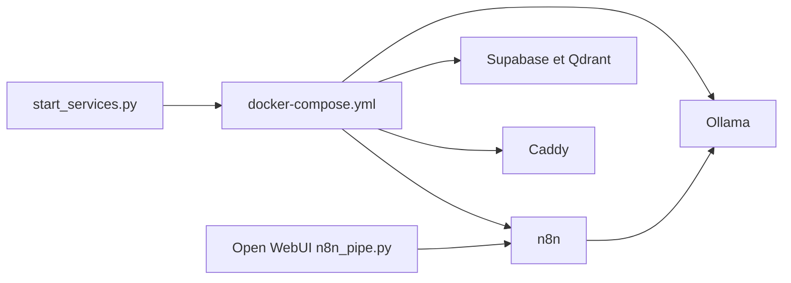

# coleam00/local-ai-packaged

> Modèle Docker Compose qui monte en local n8n, Ollama, Supabase, Open WebUI et autres briques d'IA.

## Le problème
Monter à la main une pile IA locale (LLM, base vectorielle, workflows, observabilité) prend des jours de configuration réseau et de secrets.

## Ce que ça fait vraiment
`start_services.py` choisit un profil (`cpu`, `gpu-nvidia`, `gpu-amd`, `none`) et un mode (`private` ou `public`), lance Supabase puis la pile Compose : n8n, Ollama, Open WebUI, Flowise, Qdrant, Neo4j, SearXNG, Langfuse, Caddy. Trois workflows d'agent RAG sont fournis en JSON ; `n8n_pipe.py` relie Open WebUI à un webhook n8n.

## Comment c'est branché


## Essayer
```bash
git clone -b stable https://github.com/coleam00/local-ai-packaged.git
cd local-ai-packaged
cp .env.example .env
python start_services.py --profile gpu-nvidia
python start_services.py --profile cpu
```

## Coût et pièges
Beaucoup de conteneurs, donc beaucoup de RAM. Tous les secrets du `.env` sont à générer ; les valeurs d'exemple ne servent pas en production. Le pare-feu ufw ne protège pas les ports publiés par Docker : le mode `public` ferme tout sauf 80 et 443. Des variables Supabase ont changé au fil du temps (mises à jour signalées dans le README).

## Ce que ce n'est pas
L'auteur écrit lui-même que ce n'est pas optimisé pour un environnement de production, seulement pour des preuves de concept. Les nœuds n8n « Execute Command » sont désactivés par défaut.

## Alternatives
Le « Local AI Starter Kit » de l'équipe n8n, dont ce dépôt est une version enrichie.

## Pour toi
À adopter comme laboratoire local pour prototyper des agents RAG : Apache-2.0, actif jusqu'en mai 2026, mais à ne pas exposer tel quel sur Internet.
