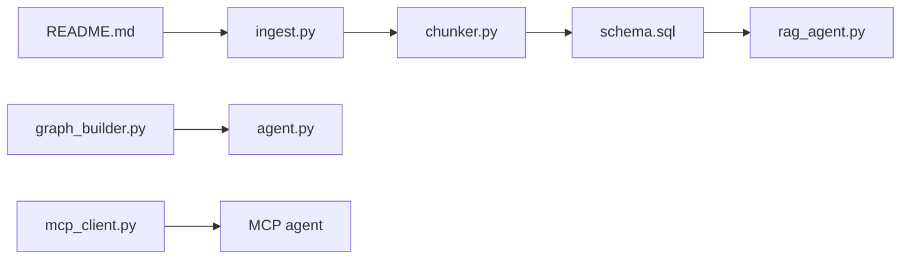

# coleam00/ottomator-agents

> Collection d'agents IA open source (Python, n8n, Voiceflow) publiés sur Live Agent Studio.

## Le problème
On trouve des démos d'agents éparpillées, rarement avec le code complet d'un RAG ou d'un agent MCP fonctionnel.

## Ce que ça fait vraiment
Chaque dossier est un agent autonome : scripts Python, apps Streamlit, exports de workflows n8n.
Plusieurs pipelines RAG complets (ingestion, découpage, stockage SQL/vecteurs), dont une variante à graphe de connaissances.
Agents Pydantic AI, LangGraph parallèle, clients MCP ; une UI Next.js (AG-UI).
Modèles de départ Python et n8n pour publier sur la plateforme.

## Comment c'est branché

## Essayer
Aucune commande dans le README racine : chaque agent a sa propre procédure.

## Coût et pièges
Clés des fournisseurs LLM par agent (`.env.example`) ; la plateforme Live Agent Studio fonctionne par jetons payants.

## Ce que ce n'est pas
Pas une bibliothèque cohérente : qualité et dépendances variables d'un dossier à l'autre. Le README est surtout promotionnel.

## Alternatives
Aucune alternative nommée dans le README.

## Pour toi
À surveiller comme banque d'exemples : les dossiers RAG (docling, all-rag-strategies) valent une lecture, le reste est du matériel pédagogique.
